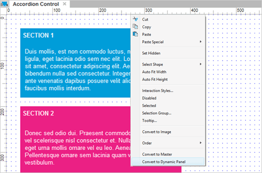
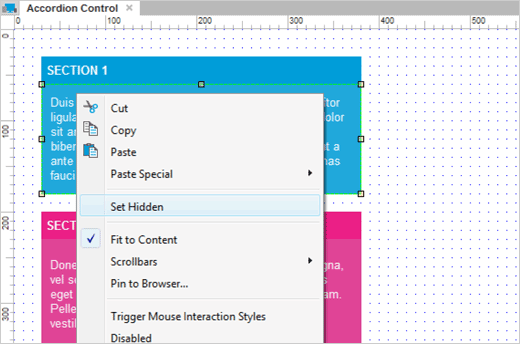
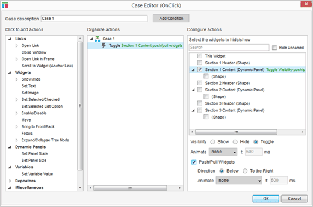
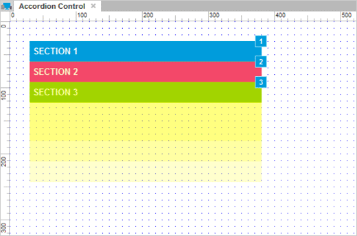

# 折叠控制

## 将内容装换成动态面板

首先打开 AxureAccordionControl.rp 然后打开 Accordion Control 面板。
 
当每个章节包含了许多部件，我们就会让其可以在动态面板中可以自由的隐藏显示。选择中一个章节的内容右键单击 Convert to Dynamic Panel 。

## 标记和隐藏内容面板

标记动态面板为 Section1Content ， Section2Content 和 Section3Content 。
 
一般地，每个章节的内容都应该被隐藏，所以对每个章节的内容右键单击隐藏。

## 切换可见性和 Push/Pull Widgets 。

选中每个章节的头部然后添加一个名为 Toggle Visibility for Section1Content 的动作，在添加一个 OnClick 事例。
 
点击 Show/Hide 动作，选中名为 Section1Content 动态面板，然后选择 Toggle 单选按钮，接着为 Push/Pull Widgets 选择复选按钮

对章节 2 和章节 3 做相同的步骤，添加切换可见性的动作到章节内容上去。

## 将动态面板放置到合适位置

让我们移动章节，让章节 2 在章节 1 下面，章节 3 在章节 2 下面。
 
现在已经完成了，预览你的原型然后测试吧。你能看到当你点击章节头部时，章节内容会扩张收缩，章节会上下移动。
