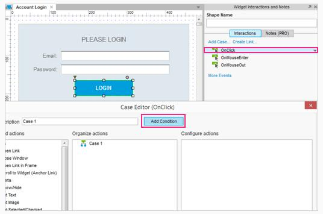
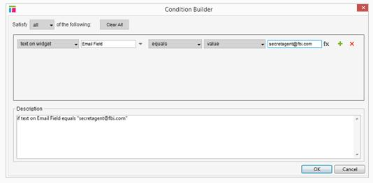
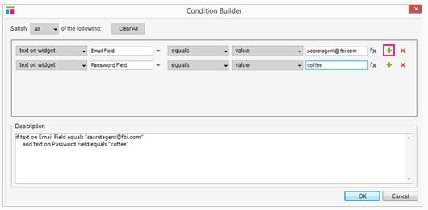
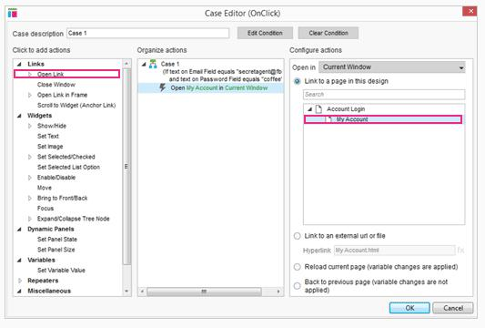
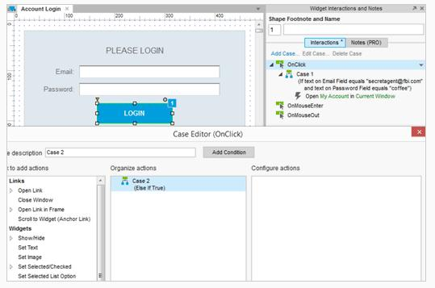
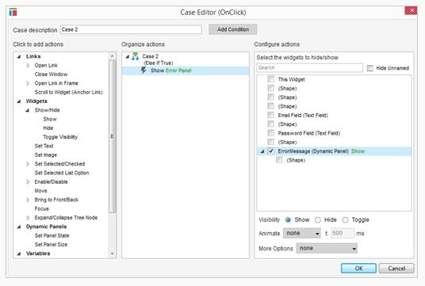

#条件逻辑:账户登录教程

##真实的登录体验

### 添加一个 OnClick Case

首先，打开[AxureAccountLogin.rp](dowloads/AxureAccountLogin.rp) 并打开“帐户登录”页面。

选择登录按钮，并添加一种 Case 到 OnClick 事件。在编辑器中，单击“添加条件”按钮。

### 构建条件

在条件构建器中，使用下拉目录和文本字段配置第一行条件为“如果文本部件电子邮件字段等于  secretagent@fbi.com”

### 添加第二个条件

单击绿色的+图标添加第二个条件。设置第二行条件为“如果文本小部件密码字段等于咖啡”。    

单击OK，关闭条件生成器。

### 添加 Case 操作

现在的条件已经明确了，如果电子邮件和密码满足设定的条件，那么我们可以添加行动来执行它。

点击“打开链接”并选择“我的账户”页面。  

单击OK，关闭编辑器。

### 添加第二个 Case “其他”

现在我们已经添加成功登录的情况，让我们添加第二种情况：如果登录不成功。双击 OnClick 事件添加第二种情况。请注意“如果这是真的”是自动添加到 Case。默认条件下，如果条件在第一种情况下不满足就会执行第二种情况。因此在此示例中，我们不需要再添加第二种情况的条件。

### 添加 Show 操作

当登录不成功，我们想要展示错误信息小部件。在 Case 编辑器中，单击“显示”添加操作，勾选错误信息复选框。

预览您的原型和测试吧！

##总结
现在你可以使用逻辑条件使你的登录事件更加的真实了。  
还需要其他帮助吗？查看[论坛](http://www.axure.com/c/forum.php)或联系我们 **support@axure.com**
