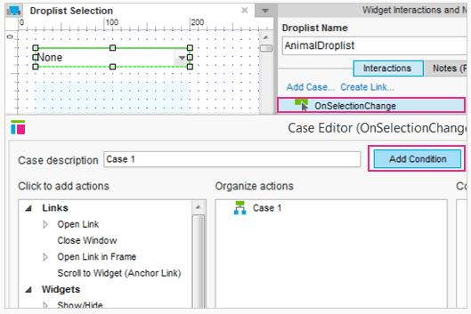
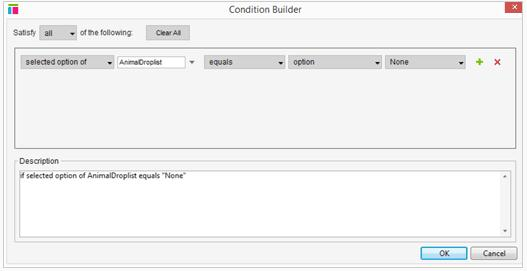
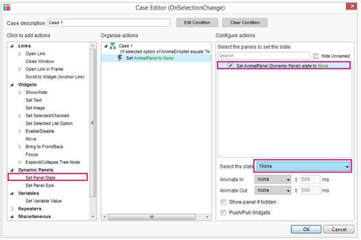
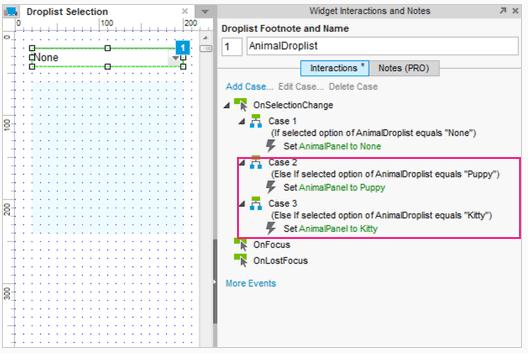
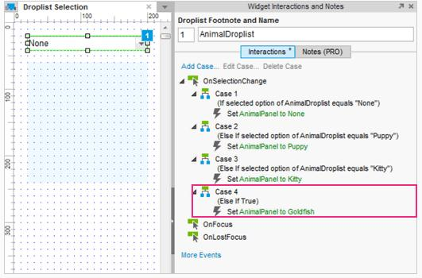
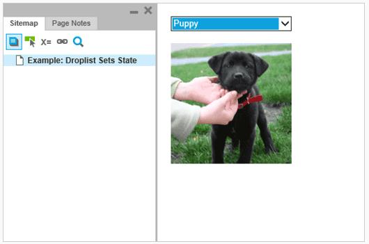

#条件逻辑：下拉列表选择教程
##下拉列表交互
### 添加 OnSelectionChange  Case 

首先，打开[AxureDroplistSelection.rp](downloads/AxureDroplistSelection.rp) 和打开“下拉列表选择”页面。
选择下拉列表并添加 OnSelectionChange  Case。在 Case 编辑器中，单击添加条件打开条件生成器。

### 构建“没有条件”

条件生成器的默认值恰好是我们所需要的。条件应该读为<如果所选选项的动态面板的值为"没有" >。  
单击OK，并关闭条件生成器。

### 添加动作来设置面板的状态

在 Case 编辑器中，单击“设置面板状态”并勾选动态面板复选框。
“没有”状态将被默认选中。  
单击OK，并关闭 Case 编辑器。

### 重复步骤为小狗和小猫设置状态

重复步骤1到3为小狗和小猫设置下拉列表 items。
第二个和第三个 Case 应该为“小狗”和“猫”设置条件，并相应地设置面板的状态。
### 添加最后的“如果其他” Case 

双击 OnChange 添加第四个4 Case，但这一次不添加任何条件。我们已经为4个有用的下拉列表项目设置了3个条件，所以如果以上3个条件都没有满足最后一个 Case 的条件将会自动生成。添加一个动作到第四个 Case ，来为金鱼设置动态面板的状态。
### 预览的原型

就是它了！预览原型和测试它吧。
##总结
现在你可以执行操作了，当一个图片在下拉列表中被选中的时候。
还需要其他帮助吗？查看[论坛](http://www.axure.com/c/forum.php)或联系我们 **support@axure.com**
