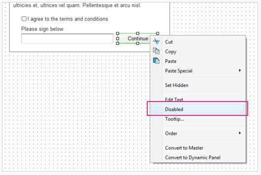
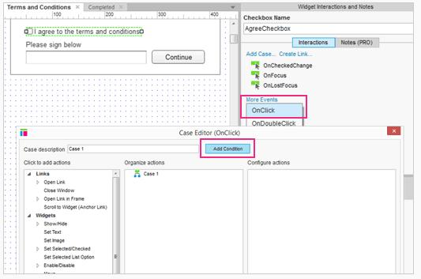
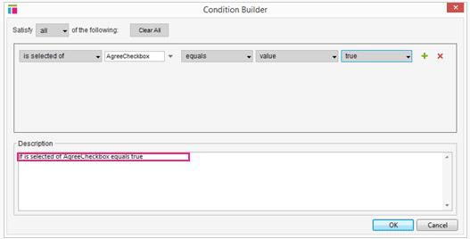
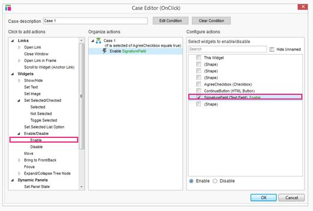
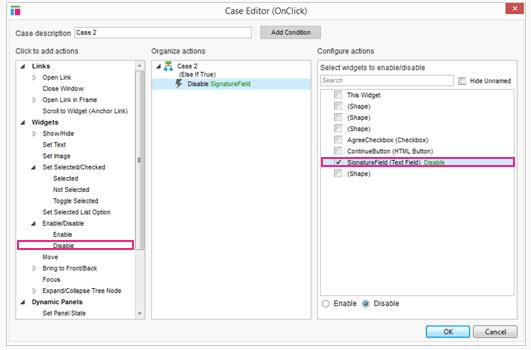
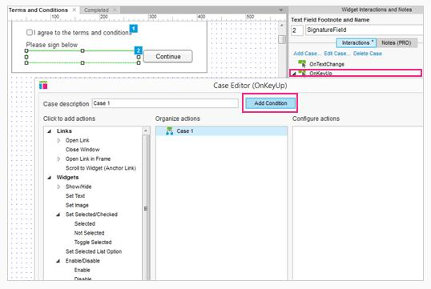
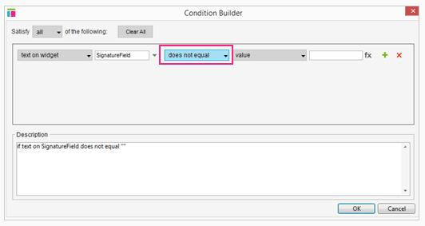
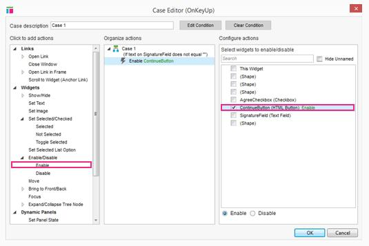

#条件逻辑: Terms 和 Conditions 的教程
##动态启动和禁用
###步骤1:禁用文本字段和按钮

首先,打开[AxureTermsAndConditions.rp](downloads/AxureTermsAndConditions.rp) 并打开 Terms 和 Conditions 页面。
让我们通过禁用的签名的文本字段和继续按钮开始吧。选择文本字段和按钮,在 properties 选项卡中勾选复“禁用”。一定要禁用形状和文本字段。
###步骤2:添加 OnClick 交互到复选框

选择复选框并添加一个 Case 到 OnClick 事件。在 Case 编辑器中,单击“更多事件> 中的 OnClick ”来打开 Conditions 构建器。
###步骤3:添加 Conditions 

 Conditions 生成最好能猜测到你会想要的 Conditions 。在这种情况下,初始化 Conditions “ AgreeCheckbox 是值为真”。  
在这里我们不需要再改变任何东西了,单击 OK 并关闭 Conditions 生成器。
###步骤4:启用标志文本

既然我们已经明确的 Conditions 了,我们可以设置动作，当 Conditions 满足时来执行它了。点击“启用”并勾选“标志文本”复选框。  
单击 OK，并关闭 Case 编辑器。
###步骤5:添加“其他” Case 

当 AgreeCheckbox 被选中时,再次双击 OnClick ,添加第二个 Case 。这是“如果这是真的” Case 。点击“禁用”并勾选 SignatureField 复选框。  
单击OK，并关闭 Case 编辑器。
###步骤6:添加 OnKeyUp  Case 到文本字段

接下来,当用户输入文本字段时我们将启动继续按钮,。选择文本字段并添加一个 Case 到 OnKeyUp 事件。在 Case 编辑器中,单击“添加 Conditions ”打开 Conditions 生成器。
###步骤7:构建 Conditions 

 Conditions 将自动设置为使用文本字段上的文字,但我们想改为中间下拉菜单中的“不平等”。 Conditions 为“文本小部件中的签名文本不能为空”。这意味着,如果有任何文本在文本字段中,这个动作在这个 Case 中会被执行。  
单击OK，并返回 Case 编辑器。
###步骤8:添加动作到启用按钮

现在点击“启用”并勾选“继续按钮”复选框。完成交互翻译为“如果有签名文本,就启用继续按钮”。如果文本为空白您还可以添加第二个 Case 来禁用使用继续按钮。

预览原型和测试它吧！
##总结
现在你可以使用限制了，在复选框或类似 onkeyup 的事件中。明白了吧！
还需要其他帮助吗？查看[论坛](http://www.axure.com/c/forum.php)或联系我们 **support@axure.com**
