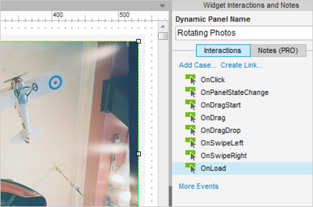
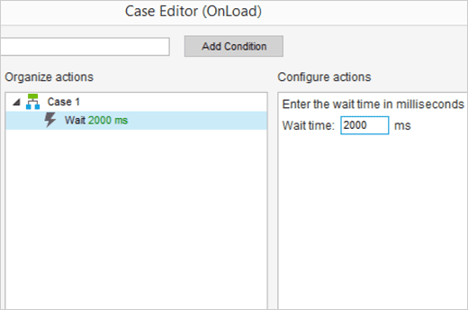
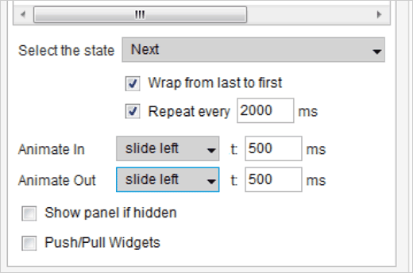

# 自动旋转标题

## 添加事例到 OnLoad 事件

首先从工具栏打开 AxureAutoRotatingBanner.rp 文件然后打开 Auto-Rotating Banner 页面。

First, from the toolbar, open the AxureAutoRotatingBanner.rp file and then open the “Auto-Rotating Banner” page.
 
选中 Rotating Photos 动态面板。在交互选项板中，添加一个事例到 OnLoad 事件中，这个会打开事例编辑器对话框。

Select the "Rotating Photos" dynamic panel. In the Interactions Tab, add a case to the OnLoad event. This opens the Case Editor dialog.

## 添加等待动作

在事例编辑器中，为 Wait 添加一个动作。设置其等待时间为 2000 ms 。

In the case editor, add the action for "Wait".  Increase the wait time to 2000ms.

## Step 3: Add action to change panel state

为页面状态添加动作

在事例编辑器中，添加 Set Panel State 动作。在下拉列表中选中 This Widget 然后将状态其指定到 Next 。

In the case editor, add the "Set Panel State" action. Choose "This Widget" and specify the state as Next in the droplist.
 
现在选中复选框 Wrap from Last to First 和 Repeat Every ，然后输入 2000 ms 。

Now check the checkbox for "Wrap from Last to First" & "Repeat Every", then enter 2000ms.
 
最后，添加一些动画到页面切换，选中 slide left 动画指定到 Animate In 和 Animate Out 。

Finally, let's add some animation while we're at it, and choose "slide left" for both the Animate In and Animate Out options.
 
预览你的原型然后测试吧。

Preview your prototype and test it out!
