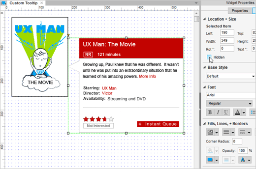
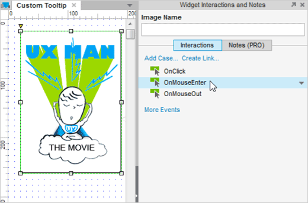

# 用户自定义 Tooltip 

## 将图片隐藏

首先打开[AxureCustomTooltip.rp](/downloads/AxureCustomTooltip.rp) 然后打开 Custom Tooltip 页面。
 
一般地，我们想让 Tooltip 隐藏起来，所以在 Style 选项板中选中 Hidden 选项。

## 使用 OnMouseEnter 来显示面板

选中 UX Man 图片然后双击 interactions 选项板中的 OnMouseEnter 选项。

## 添加显示动作

在事例编辑器中，选中 Show 然后检查 Tooltip 的图片。

## 在更多选项中选中 Treat as Flyout 

在 More Options 的下拉列表中选中 Treat as Flyout。
 
预览原型然后测试。
