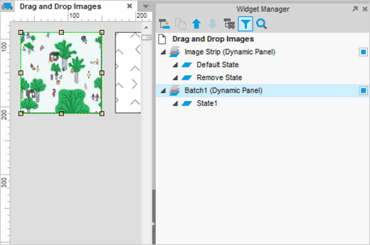
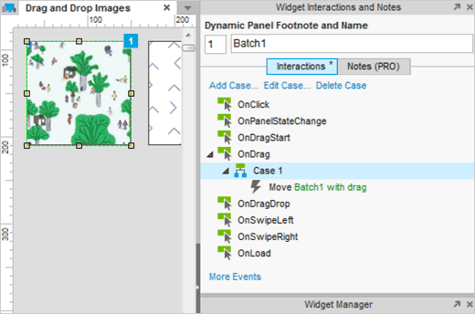
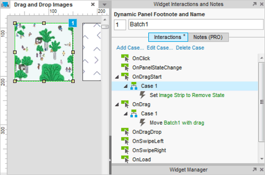
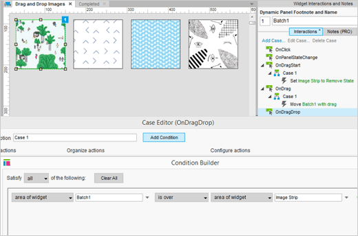
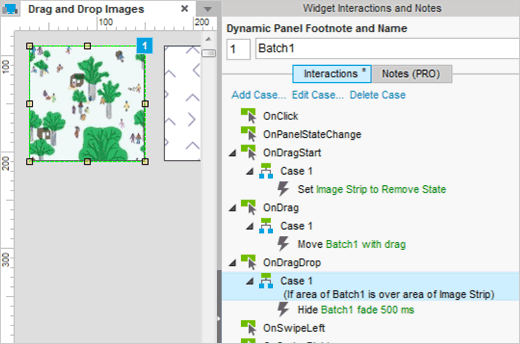
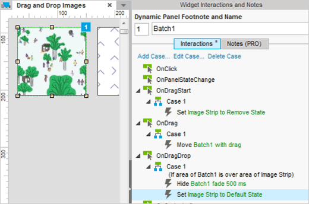
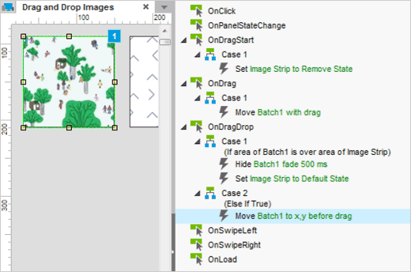
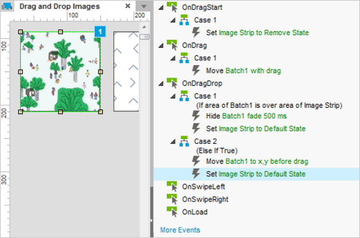

# 图像的拖拽交互

## 将图片部件装换成动态面板

首先打开 AxureDragAndDropImages.rp 然后打开 Drag and Drop Images 页面。

在设计区域选中第一张图片的缩略图。先右键单击图片在弹出的菜单中选中 Convert to Dynamic Panel ，这样就可以让其可拖拽。

将这个面板标记为 Batch1 。

## 添加 OnDrag 事例到 Move with drag

为了拖动图片，通过一个动作添加一个事例到 OnDrag 事件然后指定到 Batch1 面板。一般地，这个移动动作被设置到 Move Batch1 with drag ，点击 OK 关闭事例编辑器。

## 添加 OnDragStart 事例

当用户拖动图片时，我们想要设置图片有一个状态可以显示下面的信息， Drop an image here to remove it from the batch.

在拖动开始时我们想设置这个面板，所以通过设置 Set Panel State 添加一个事例到 Batch1 的 OnDragStart 事件。指定图像带面板和删除的状态。单击 OK 关闭编辑器。 OnDragStart 案例添加应该类似于上面的截图。

## 添加条件到 OnDragDrop 和 事例 1

当你拖动图片进入页面时，你展现的交互效果取决于你的拖动方式。

在第一个条件中，我们想检查是否是拖动图像的顶部带区域，我们添加一个事例到 OnDragDrop 事件，点击  
Add Condition 然后添加条件 If area of widget Batch1 is over area of widget Image Strip 。
点击 OK 关闭 Condition Builder 。

## 隐藏某批次的图片

当图片拖进 Image Strip 区域时，我们想将其从批次中移除，所以在事例编辑器中，选中 Batch1 面板的 Hide 选项，然后添加一个平淡的动画。

## 设置 Image Strip 返回默认状态

设置 Image Strip 的默认状态，打开事例编辑器，选中 Image Strip 面板的 Set Panel State 设置默认状态。

测试原型，当你拖动第一个图片进入 Image Strip 时，图片将会渐渐淡出，而 Image Strip 将会恢复默认状态。

## 添加第二条件到 OnDragDrop 事件

现在我们另一个条件是如果图片从 Image Strip 被拖动到其他区域。

在 Batch1 面板中，通过添加动作 Move Batch1 to x,y before drag 第二事例到 OnDragDrop 事件中。

## 设置 Image Strip 返回默认状态

除了移动图像回到原来的位置，我们也要设置 Image Strip 返回默认状态。所以我们要添加第二个动作 Set Image Strip state to Default State 到这个事例中去

当这个事例符合第一个条件时，这个事例被自动这是为 Else If True 。

预览这个原型然后测试他。当你拖动图片缩略图到其他区域而不是 Image Strip 时，他将回到之前的位置，然后 Image Strip 会返回到默认的状态。
