#从头构建一个电子商务网站

## 介绍

本教程引导您一步一步来构建一个电子商务网站的原型，将会使用的许多 Axure RP 原型的核心特性，包括 Masters 和动态面板。我们将从头开始创建整个样本。     

## 让我们开始吧

首先，下载[AxureEcommerce.zip](/downloads/AxureEcommerce.zip)并解压缩到你的电脑。然后，启动 Axure RP 和保存一个新文件作为电子商务原型。rp 使用文件 > 另存为。

## 创建一个 Header Master

### 创建一个 Master

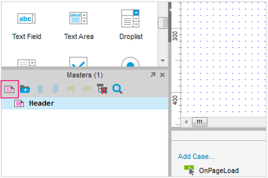 

第一步是构建一个 header，用来放置 logo 和导航。因为我们需要在多个页面中使用这个 header，所以我们将它新建成 master。

在 Masters 面板中，单击添加按钮。然后缓慢双击新 masters 改名为 Header。

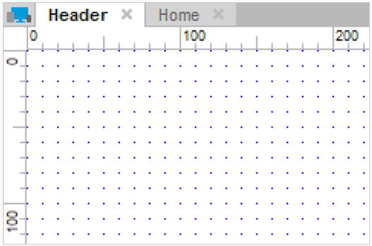
 
双击 Header Master 开始编辑。你可以通过查看设计区域顶部的选项卡来看看哪个 master 或者页面正在被编辑。

如果它指示的是 Header，说明你在正确的位置。

### 添加一个 logo image

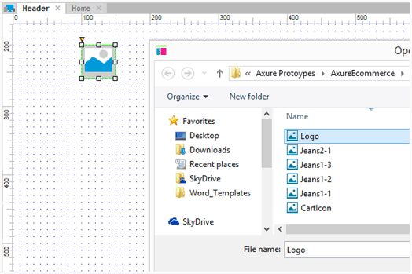 

拖出一个 image 部件到设计区域。双击导入你的 logo。从压缩包文件的 images 文件夹中选择 logo.png 图片。

当被问及是否要按照图片大小加载，选择 Yes。这将使用实际尺寸的图片，而不是当前图像部件的大小。

### 添加按钮作为导航

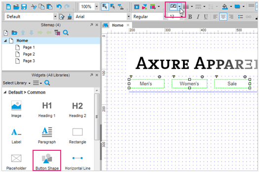 

接下来，我们将在图标下添加3个 Button Shape 小部件。

在小部件窗格中，向下滚动找到 Button Shape 部件(不是按钮部件)。将3个按钮形状部件拖到设计区域。双击每一个更改文本。分别改为“男性”，“女性”，“出售”。

要使边界颜色变成白色，可以选择所有的按钮形状(单击并拖动创建一个选择按钮区域)，并通过上方的工具栏设置 Line Color 为白色。

### 添加一条水平线

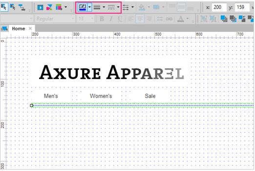 

让我们添加一条水平线，来分离的标题下面的内容。

将一个 Horizontal Line 小部件拖到设计区域。可以通过拖动水平线的左边或者右边的小白点来调整长度。然后通过编辑模式和颜色工具栏的按钮，使水平线变成一条蓝色的虚线。

### 添加 Header 到主页

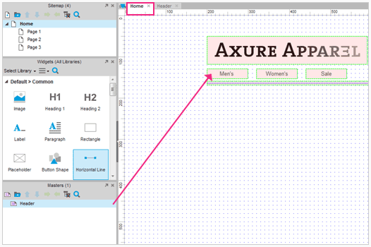

将 Header master 从 Masters 面板拖动到设计区域，即可将它添加到 主页面中。将它放到坐标为（200，50）的位置。

默认情况下， masters 有一个粉红色的底色。你可以关掉，使用 View > Mask Masters。

## 创建产品缩略图和 QUICK VIEW 按钮

### 添加产品缩略图

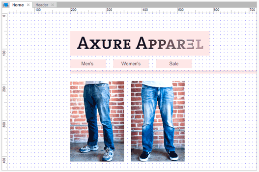 

在主页上，将一个图像小部件拖到设计区域，并将它放在 header 下方。

双击它，导入 Jeans1-1.png。添加第二个图片，导入 jeans2-1.png。

按住 shift 键并拖动图像的角部，拉伸图片到是 150px 宽，225px 高。

### 添加 Quick View 按钮

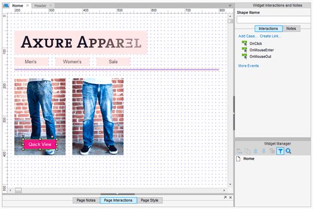 

拖动一个 button shape 到第一款产品图片上。双击并改变文字为 Quick View。

### 标注并隐藏 Quick View button

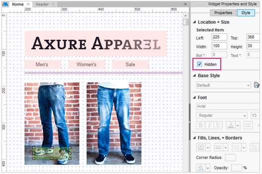 

我们希望当鼠标在图像上时，Quick View 按钮才显示，所以将其设置为默认隐藏。

通过在样式选项卡中勾选 Hidden，然后小部件将会变黄。

### 动态显示按钮

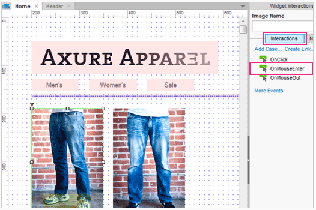

为了当鼠标在产品的图片上，Quick View 按钮才出现，我们将使用 OnMouseEnter 事件。

点击产品图片。在小部件属性的交互选项卡窗格中添加一个案件 OnMouseEnter 通过双击 OnMouseEnter(见上图)。这将会打开编辑器。

### 添加 ShowQuickViewButton

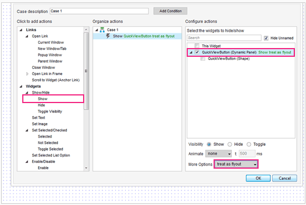

在左侧面板中，单击 Show。然后在右侧面板中，单击 QuickViewButton 复选框。最后，从下拉框的 More Options 选择 Treat as Flyout。单击OK。

让我们使用工具栏上的预览图标预览原型。移动鼠标到产品上方，Quick View 按钮就要显示，但是只要它显示过就不能被隐藏。

## 产品详细信息弹出窗口和幻灯片

### 创建产品详细信息弹出窗口

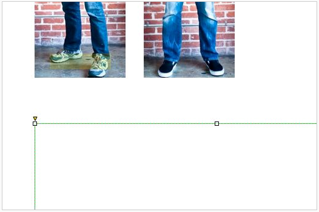

在所有内容的下面，添加一个 rectangle 部件到设计区域。然后，调整为大小为 600 x 450 的矩形。

右键单击矩形并选择 Convert to Dynamic panel。这种动态面板标注 ProductPopup。

### 添加产品大图

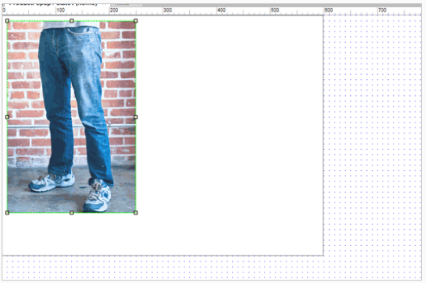

在这一步中，我们将会添加一个产品图片的幻灯片，当你点击缩略图后它会通过动画展示出来。

首先，双击打开 ProductPopup 的 State1 。拖动图像小部件和双击导入 jeans1-1.png。将这张照片放在在左上角的地方。

### 将图像转换为动态面板

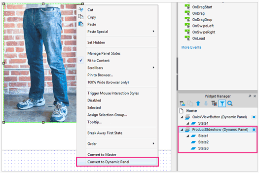 

在图像上单击右键并选择 Convert to Dynamic Panel。标注这个面板为 ProductSlideshow。
我们一共有3个 states，在小部件管理器中选择 state1 ，然后单击 Duolicate State 两次来创建3个 states。

### 插入 Jeans-2 和 Jeans-3 states

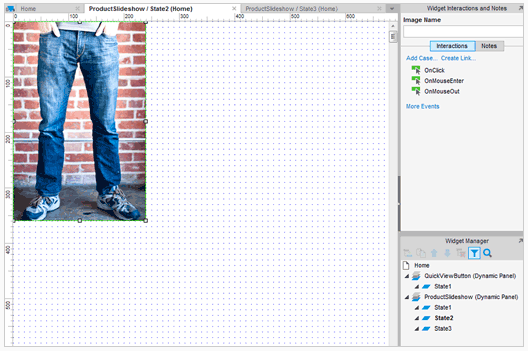

打开 state2，通过双击图像将 Jeans-1 图像换为 Jeans-2 图像。为 state3 做同样的事情，每个状态都有不同的 Jeans 图片。

### 添加产品图片缩略图

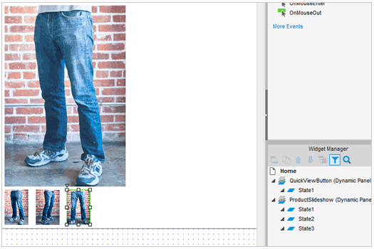 

拖入3张图像小部件作为缩略图，导入 Jeans1-1、Jeans1-2，Jeans1-3。拖动调整图像大小，按住 Shift 键来保持图像的宽高比。

### 添加 OnClick 事件到缩略图

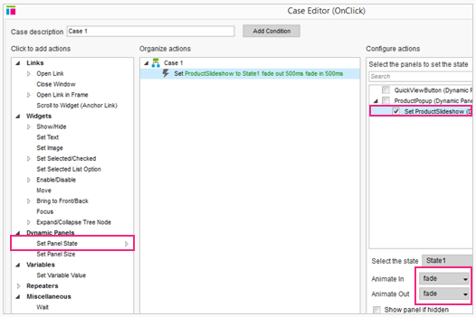

选择最左边的缩略图，双击 OnClick 事件。在编辑器中，选择 Set Panel State 操作和选择 ProductSlideshow 面板。
在 Select the State 下拉框中，选择 state1，然后选择消失的动画为渐入和渐出。单击OK。

### 复制/粘贴 case 到缩略图2 & 3

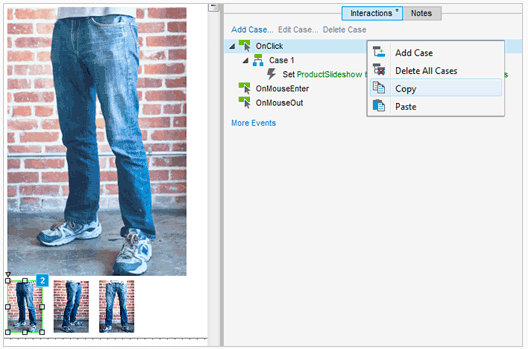 

从第一缩略图到第二和第三依次复制和粘贴新的 case。双击粘贴 case，让第二个缩略图的面板 state 为 State2，然后为 State3 做同样的事情。

预览您的原型。点击缩略图应该得到面板状态相关的牛仔图片。

## 加入购物车 

### 创建添加到购物车按钮

拖动一个 button shape 部件到弹出窗口的右下角。使用工具栏给它填充蓝色和白色字体。改变文本为 Add to cart。

### 创建购物车消息弹出面板

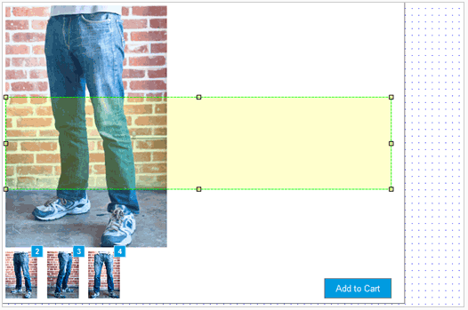

现在我们将创建 Processing 和 Added 信息，它们将会点击 Add to Cart 的时候显示。

拖动一个 rectangle 到弹出框的中间。让它变成浅灰色和黑色的字体。输入文本为“处理中…”。

右键单击并选择[Convert to Dynamic Panel]。使用复选框的样式选项卡设置面板隐藏。

### 导入 Added to Cart 状态

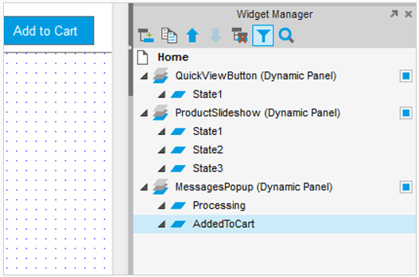 

标注动态面板为 MessagesPopup 和第一个 state 为 Processing。

当 Processing state 被选中时，点击 Duplicate State 图标添加第二个 state。并标注它为 AddedToCart。

### 创建 Added to cart 消息

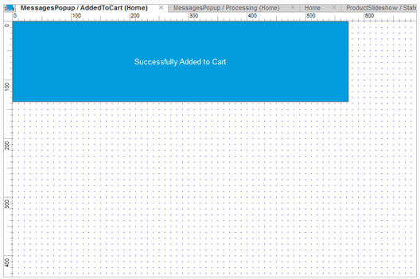 

打开 AddedtoCart 状态，当我们确定 item 已经被添加后，将 item 的颜色改为蓝色。双击并更改文本 Successfully added to Cart。

### 添加 Add to Cart 的交互

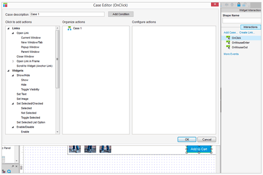 

单击 Add to Cart 按钮后，想要展示的 Processing 的信息和 added to cart 消息，然后隐藏。

回到 ProductPopup，并选择 added to cart 按钮。双击鼠标单击添加 case 并打开 case 编辑器。我们准备給这个 case 添加5个动作。

### 添加显示/隐藏的信息的操作

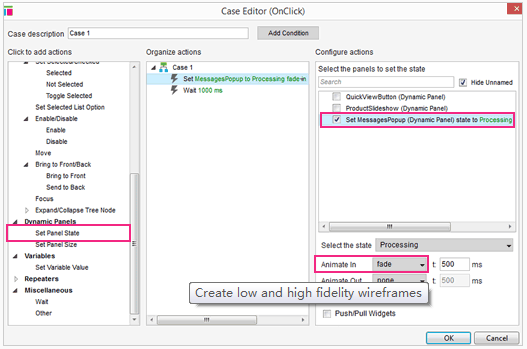

1:设置面板 MessagesPopup 状态为 Processing。从动画的下拉框中选择 fade。注意，设置面板状态为自动显示面板，所以我们不需要添加一个显示面板操作。

2:等待 1000ms。这设置第一个面板和第二个面板之间间隔时间。1000毫秒 = 1秒。

### 改变MessagePopup面板状态

3:设置面板 AddedtoCart 状态。在这个动作我们设置 MessagesPopup 面板从 Processing 状态到 AddedtoCart 状态。单击MessagesPopup 复选框，并选择下拉 AddedtoCart 状态下的复选框。

4:等待1000 ms(再一次)。

### 添加隐藏面板交互

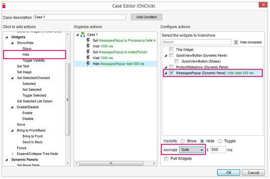

5:隐藏面板。单击 MessagesPopup 复选框并选择 fade 动画。

单击OK。预览您的原型和测试。这将是我们电子商务的新手介绍的最后一部分。

## 隐藏/显示产品信息

### 添加关闭 ProductPopup 按钮

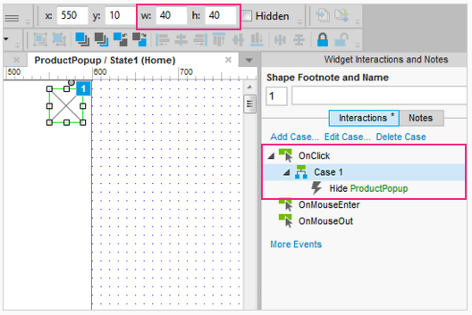

接下来，我们将給 ProductPopup 添加一个关闭按钮。

添加一个 placeholder 到动态面板的右上角。调整其大小 40×40。(提示:您可以在工具栏中编辑大小)。

給 placeholder 添加一个 Hide 操作的 Onclick 事件，让 ProductPopup 隐藏。

### 设置 ProductPopup 隐藏

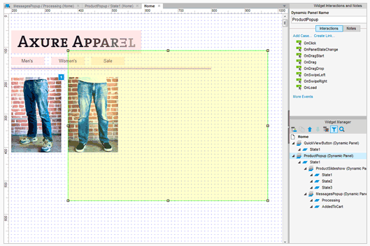

当点击 Quick View 的时候，这个面板将会被隐藏。右键单击面板，选择设置“隐藏”。

### 浏览器定位

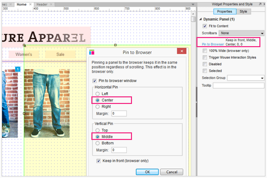 

选中隐藏的动态面板，在 Properties 选项卡里面选择 Pin to Browser。选择 Center 和 Middle，然后单击 OK。

### 添加 Quick View 显示面板

 

现在，我们准备添加 Quick View 按钮的交互事件，当点击的时候用来显示ProductPopup。

选择 Quick View 按钮，添加一个 Show Panel 的点击事件来显示 ProductPopup。然后从更多选项中选择 Treat as Lightbox。

预览您的原型和测试。这是我们給新手带来的电子商务介绍的最后部分，恭喜!

