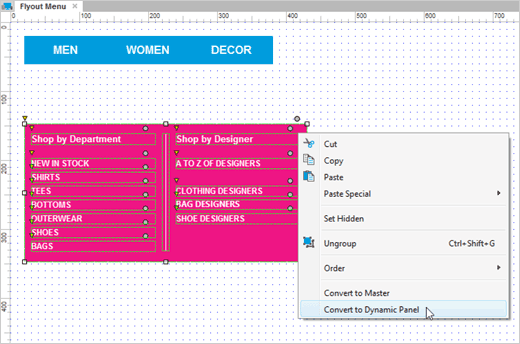
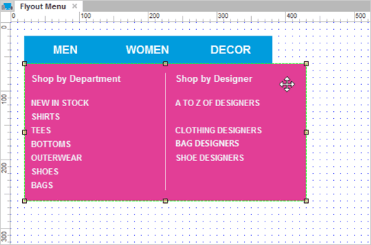
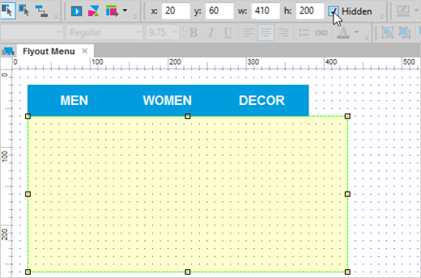
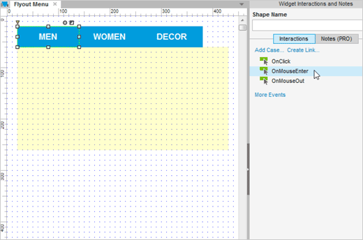
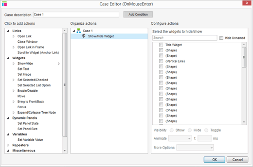
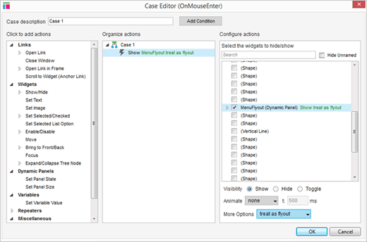

# 制作用户自定义的下拉菜单

## 第一步：把菜单装换成动态面板

首先打开[AxureFlyoutMenu.rp](/downloads/AxureFlyoutMenu.rp)，然后打开 Flyout Menu 页面。

选中内容和右键单击，然后选择 Convert to Dynamic Panel 。标记这个面板为 MenuFlyout 。

## 第二步：定位部件到导航项目下

移动菜单直至导航按钮刚好在菜单之上。

## 第三步：隐藏菜单

在样式表中将 Hidden 复选框选中，隐藏菜单。

## 第四步：添加 OnMouseEnter 事件

选中 Men 这个导航按钮，然后双击 OnMouseEnter 事件。

## 第五步：选中显示面板的动作

在事例编辑器中，选中 Show/Hide 动作。

## 第六步：选中面板中的 Treat as Flyout

选中 FlyoutMenu 然后在下拉列表中选中 Treat as Flyout。

预览你的原型然后去测试吧。
