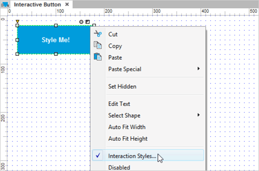
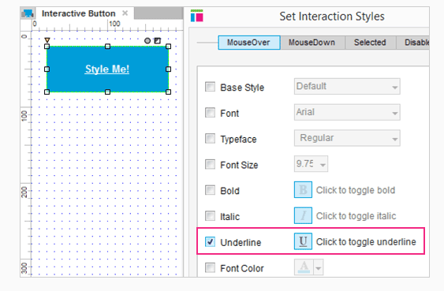
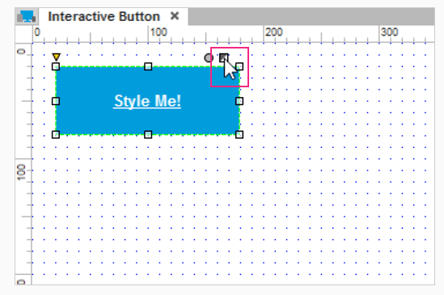
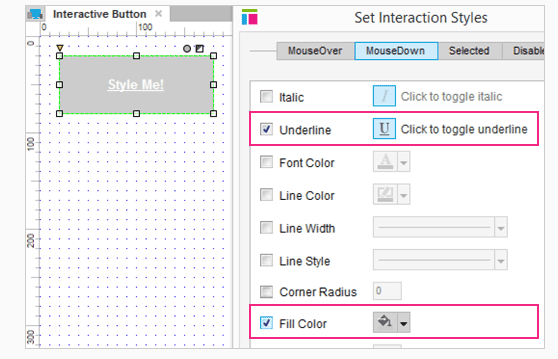
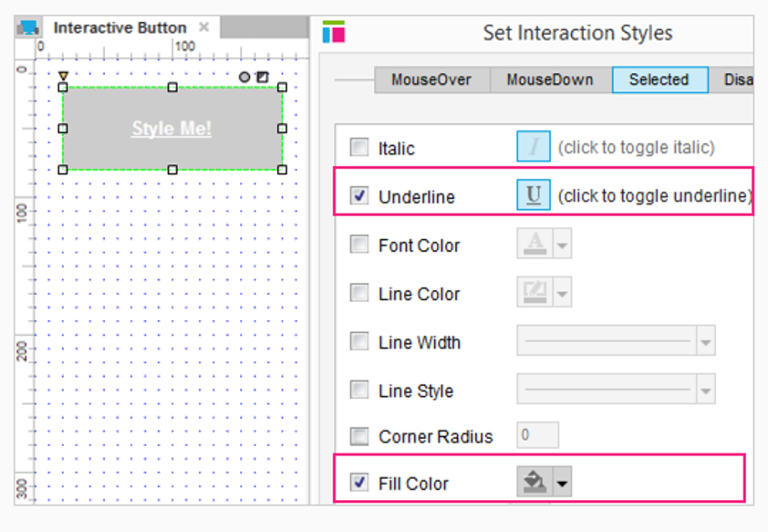
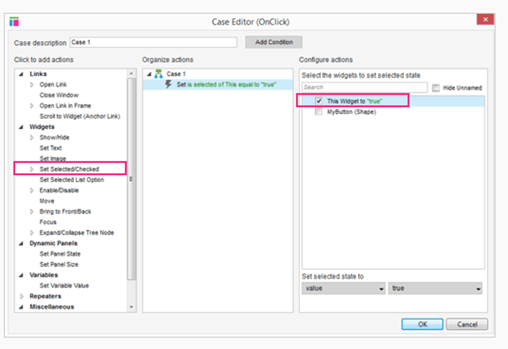

# 按钮的交互

## 打开 Rollover Style 对话框

首先打开 AxureInteractiveButton.rp ，然后打开 Interactive Button 页面。
 
右键单击按钮，选中 Interaction Styles... 选项来打开 Interaction Styles 对话框。

## 编辑 MouseOver Style 

在 MouseOver 选项板中选中 Underline 。这会让按钮中的文字显示下划线。

点击 OK 关闭对话框。 

## 在 Axure 中预览样式

当部件应用一个 Interaction Style 时，点击在按钮右上方的一半是白色而另一半是黑色的按钮。点击翻转白色的三角运行你预览各种各样的样式。

## 编辑 MouseDown Style

现在设置当鼠标按下按钮时显现的 MouseDown Style 。
 
在这一次，在 Properties  选项板中选中 MouseDown 来打开 Interaction Style 对话框。让我们再次通过复选框以及颜色选择器来添加下划线以及填充灰色。不要太快关闭 对话框。 

## 编辑 Selected Style

当按钮处于选中状态时 Selected Style 将会显现出来。这个最常用来指定用户当前的页面。
 
在 Selected 选项板中选中 underline 复选框然后添加一个 darker grey 。

点击 OK 关闭对话框。

## 点击时按钮被选中

通过动作 Set Selected/Checked 添加一个事例到 OnClick 事件。然后选择复选框 This Widget 。

作为一种选择，你可选中 MyButton ，但是选中 This 将允许你复制粘贴一个交互到不同的部件而不用每次都改变目标部件。
 
预览原型然后测试 MouseOver ， MouseDown ，和 Selected 的样式。
