#介绍动态面板

---
通过动态面板创建一个简单的图片循环预览，添加一个图片控件（Image Widget）到画布中，然后在向按钮（button）到添加交互项。

## 创建一个新文件
### 1 增加一个图片和按钮
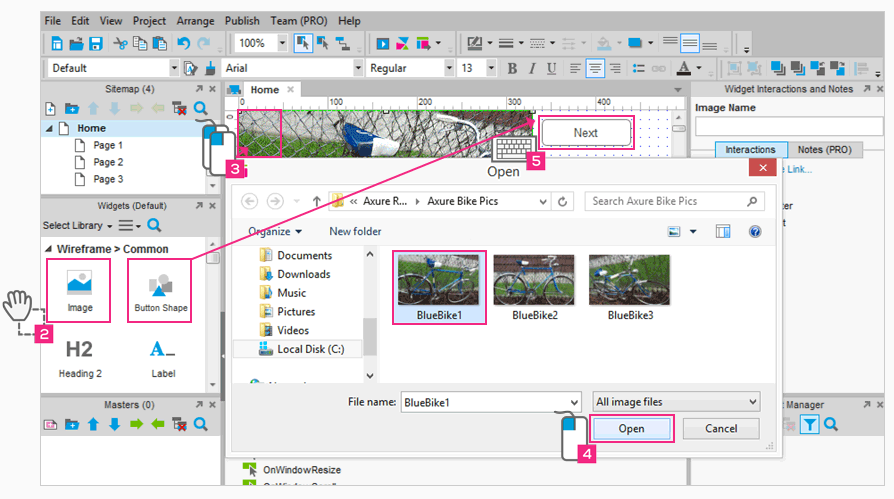

> 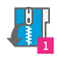 
[下载 "AxureBikePics.zip" ](http://bit.ly/SP0LrH) 然后解压到你电脑上的图片文件夹，如果你喜欢你可以使用你自己的图片。

>  增加一个图片和按钮到画布（涉及区域）中去。

> 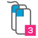 双击图片控件然后选中第一张图片"BlueBike1"。

> 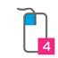 点击 "Open"(打开)选项使用图片，然后点击弹出对话框的"Yes"选项可以自动调整大小哦。

> 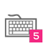 选中按钮控件修改其名称为"Next"。

---

### 2 转换为动态面板然后添加状态
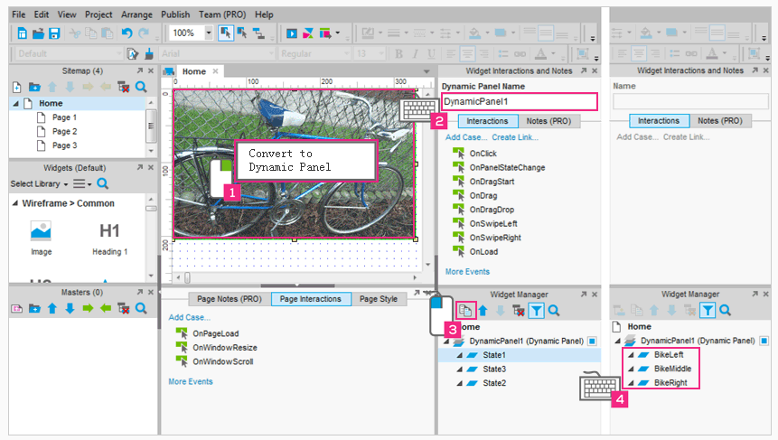

> 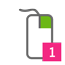 右键选中图片控件，点击弹出的选项"Convert to Dynamic Panel".

> 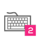 重新命名动态面板为 "DynamicPanel1".

>  在部件管理面板(Widget Manager pane)中选中"State1"和"Duplicate
State"图标。

>  输入三个状态"BikeLeft","BikeMiddle",and "BikeRight"。

---

### 3 给每个状态添加图片
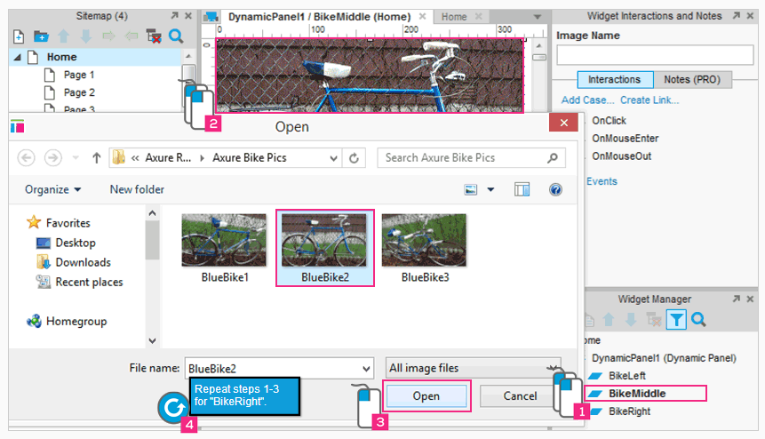

> 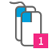 在部件管理面板(Widget Manager pane双击"BikeMiddle"状态，以便在设计区域编辑

> 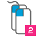 双击图片控件导入第二张图片

>  点击 "Open"(打开)选项使用图片，然后点击弹出对话框的"Yes"选项可以自动调整大小哦。

>  对"BikeRight"状态重复以上三步

---

###4: 点击下一个面板到下一个状态
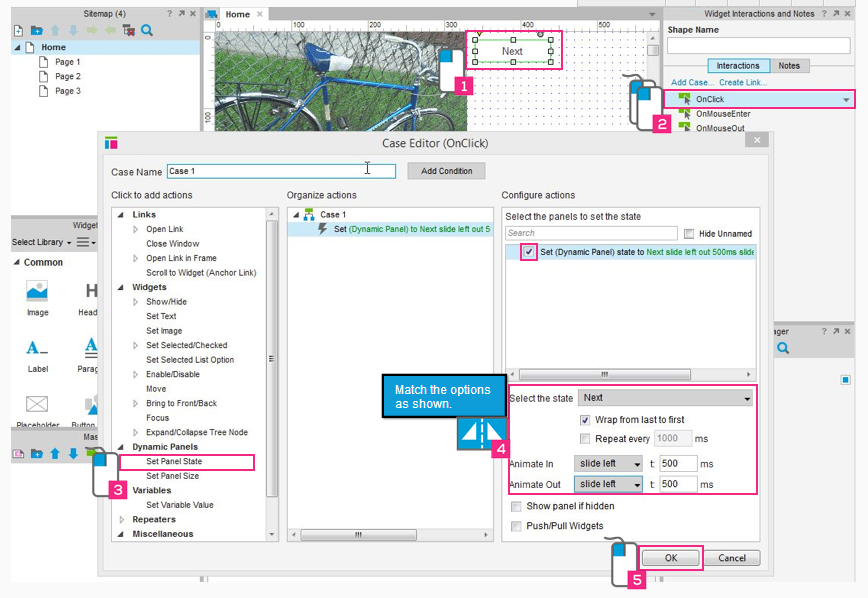
> 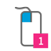 在主页中选中"Next"按钮

>  双击OnClick事件为按钮添加响应

>  在最左边的控件区选中动作(action)"Set Panel State"

>  如上图所示选中"DynamicPanel1"面板为动作匹配选项

> 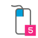 点击"ok"按钮添加动作

---