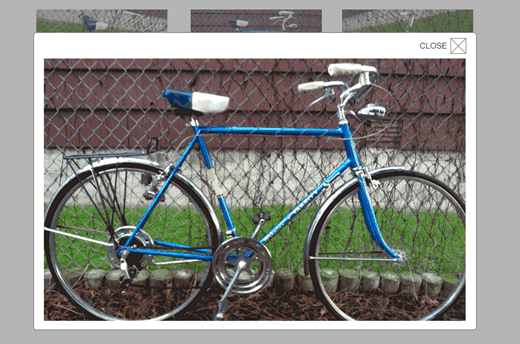
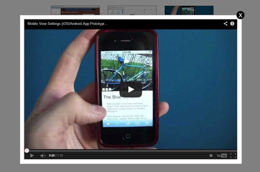
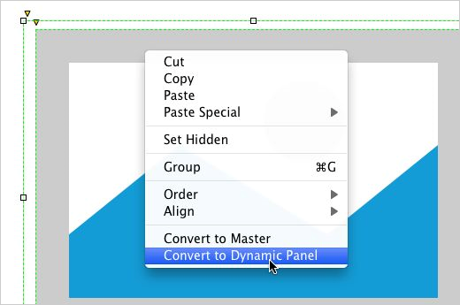
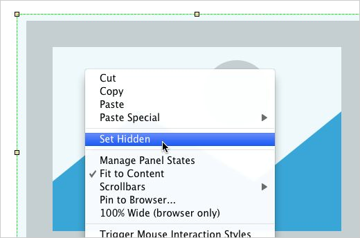
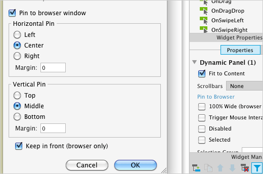
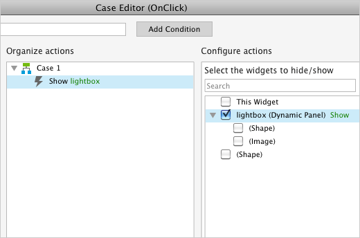
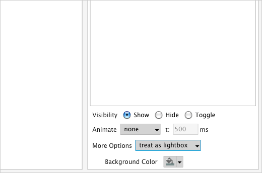

# 视频与图片的 Lightbox

# 关于 LIGHTBOX

在网站上用于显示大图或者播放视频的常用控件就是 Lightbox 了。一般地， lightbox 背景周围一般会变成灰色，有助于让人们的注意力集中在 lightbox 所显示的内容上。点击 lightbox 周边区域或者 close 按钮可以关闭 lightbox 。
 
在 Axure RP 中，你能通过 treat as lightbox 设置背景变暗，再将其添加到 Show/Hide 动作上去。一个通过上诉方法实现的简单的图片视频 lightbox 示例可以下载 [AxureWebsite.zip](http://d3g1p8ush40lh4.cloudfront.net/Tutorials/v7/AxureWebsite.zip) 。

# lightbox 示例

## 图片 Lightbox

Lightboxe 经常被用于展示大图，为了构建此类的 lightbox ，你可以通过一个图片创建一个动态面板，当图片的缩略图被点击时， lightbox 面板就会暗化背景，显示大图。使用动态面板显示一张图片也可以设置相似的状态达到同样新的效果。

[查看例子](http://share.axure.com/1F4GO9/Image_Lightbox.html)

## 视频 Lightbox

使用内嵌的窗口，视频能够通过 lightbox 进行播放。

当你想隐藏 lightbox 时，你应该添加一个动作，让其在所有浏览器中适当地被隐藏。
 
[查看例子](http://share.axure.com/1F4GO9/Video_Lightbox.html)

# 创建一个居中的，背景暗化的 Lightbox 

## 将图片和画面装换成动态面板

首先打开 AxureLightboxTutorial.rp 。然后打开 Lightbox Tutorial 页面。

我们先选择图片和矩形，同过右键单击选中 Convert to Dynamic Panel选项，将他们转换成动态面板。 将其标记为 lightbox 。

在一个交互动作中，我们能够隐藏和显示多个小部件。

## 隐藏它

在显示 lightbox 之前，我们想让它处于隐藏状态，所以右键单击它，点击 Set Hidden 选项。

## 捎到浏览器去

选中 lightbox ，在 Properties 选项板中单击 Pin to Browser 选项。

在弹窗中，选上 pin to browser window ，然后选上 Center 和 Middle 。点击 OK 。
 
然后当 lightbox 显示时就会出现在屏幕中间了。

## 添加 OnClick 事件到按钮

选中名为 Show Lightbox 的按钮，在 Interactions 选项板中双击 OnClick 事件。

## 在更多选项中选中 treat as lightbox

在事例编辑器中，从 More Options 下拉列表选中 treat as lightbox 。

这个设置将在颜色选择器中指定显示小部件与彩色背景。
