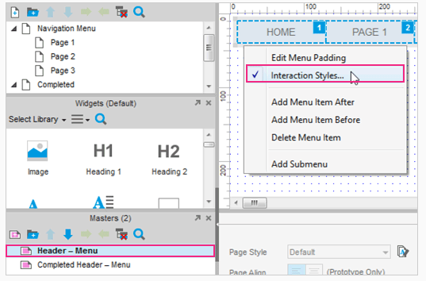
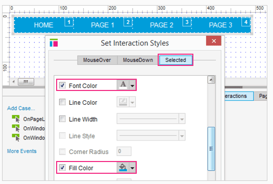
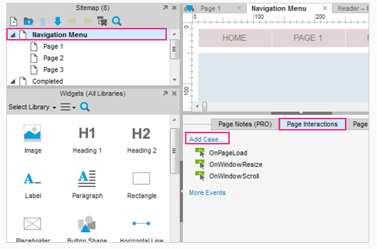
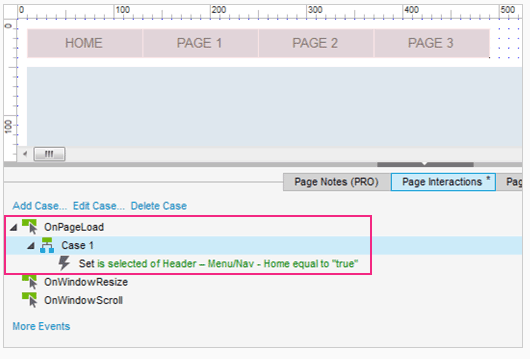
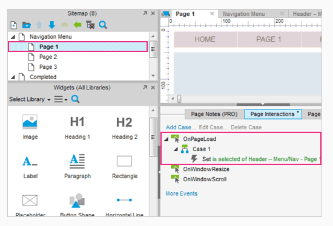
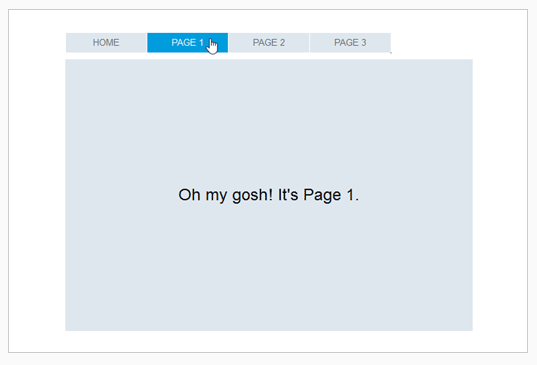

# 导航菜单

## 打开主菜单编辑 selected 样式

首先打开 AxureNavigationMenu.rp 然后从 Masters 页面打开 Header – Menu 。

按下 Shift 键，逐个选中菜单部件的所有导航项。全选后，对它们右键单击选中 Interaction Styles... 选项，会弹出一个 Set Interaction Styles 对话框。

## 在 Selected Style 选项板中设置填充颜色和字体

在 Selected Style 选项板中，我们将设定我们的 selected style 。选择字体颜色和填充颜色。设置填充颜色为深蓝，然后字体颜色为白色。当然你可以设置任何你喜欢的颜色。

点击 OK 关闭对话框。

## 为页面添加 OnPageLoad 事例

在 Sitemap 面板双击 Navigation Menu 页面。

在 Page Interactions 选项板中，通过点击 Add Case 添加一个事例到 OnPageLoad 事件。然后会打开一个事例编辑器。

## 将部件设置为 Selected Style

当页面加载时，我们会设置 Home 导航按钮到页面中去。
 
在事例编辑器中，选中 Set Selected 动作指定到 Nav – Home 部件。
 
点击 OK 关闭事例编辑器。

## 给每一张页面添加 OnPageLoad 事例

就像我们为 Home 页面所做的，通过相同的菜单为第一到三页面添加一个 OnPageLoad 事例到它们的 selected style 。例如，页面 1 的 OnPageLoad 事例，设置 Nav – Page 1 到它的 selected style ，然后为 Page 2 和 Page 3 使用相同的操作。

## 预览原型

预览原型然后测试它吧。加载的每一页面都应该被设置到了导航栏中。
