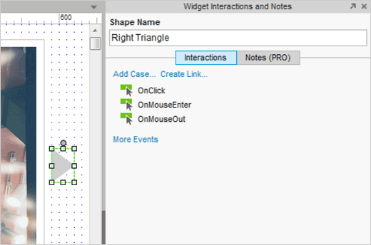
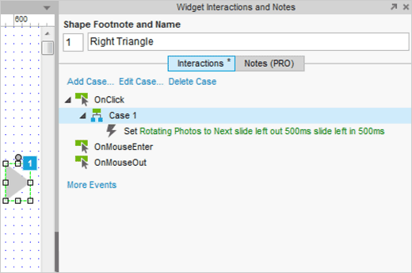
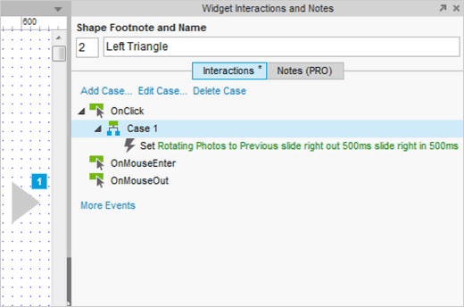

# 图片循环显示

## 添加一个点击事例到图中右箭头

先打开AxurePhotoCarousel.rp，然后打开图片循环(Photo Carousel)页面。

创建一个循环图，添加一个可以在你点击图中右箭头的时候改变图片的点击事例。

选中图中的右箭头然后添加一个事例到点击事件中，这时会出现一个事例编辑对话框。

## 设置面板状态为 "Next"

无论用户看的是哪张图片，我们都想在点击右箭头能够切换到下一张图片。为了达到图片切换的效果，我们选择动作“Set Panel State”，把“Rotating Photos”面板勾选上，从“Select the state”下拉列表中选中“Next”这个状态。
 
接下来，你就可以添加动画进去了，选择"Slide Left"这个动画，然后对应到“Animate In” 和 “Animate Out”，接着把过渡时间都设置为500ms（毫秒）。

点击OK按钮关闭事例编辑器，事例就像截图中所展示那样，已经被添加到OnClick（点击）事件中去了。

## 对左箭头重复步骤2

现在再给左箭头添加一个简单的交互，选中左箭头添加点击事例。

再一次使用事例编辑器，重复步骤2，设置面板状态为"Previous"，为其添加动画。

点击OK按钮关闭事例编辑器，事例就像截图中所展示那样，已经被添加到OnClick（点击）事件中去了。

完成上诉步骤，就可预览原型了。
