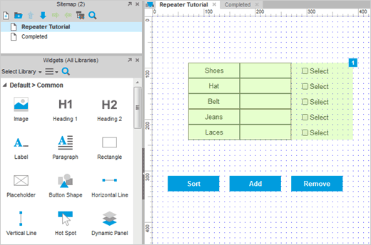
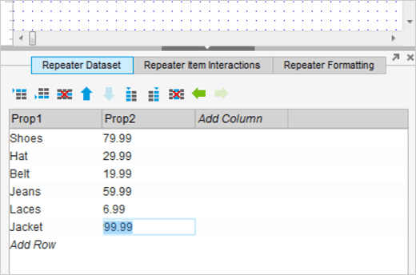
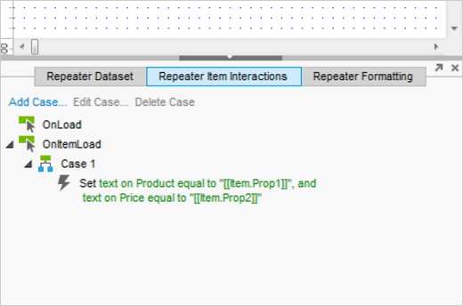
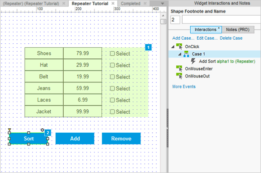
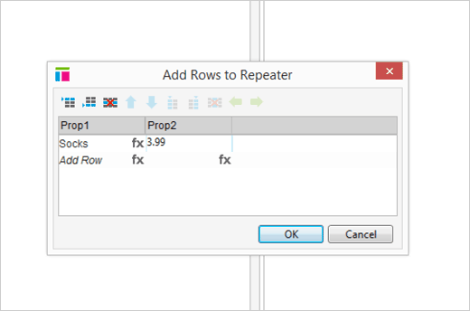
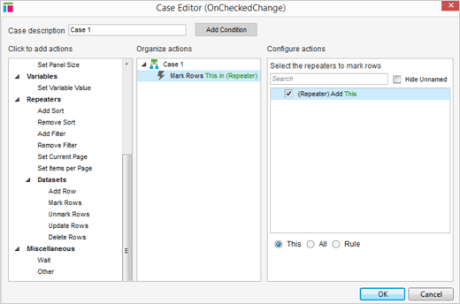
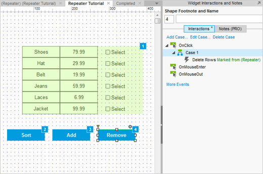
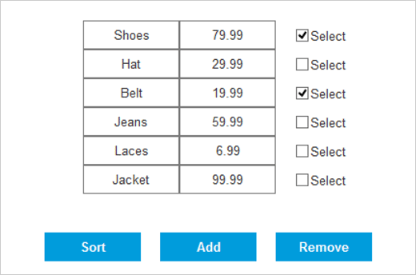

# Repeater 小部件教程

## Repeater 教程

### 第一步：双击 Repeater 小部件

首先，打开 [AxureRepeaterTutorial.rp](downloads/AxureRepeaterTutorial.rp) ，然后打开 Repeater Tutorial 页面。

在这个示例中，我们会创建一个简单地数据集，允许你对其进行增加，删除，排序等操作。

双击 repeater 小部件（泛绿的那块）来对其进行编辑。

### 第二步：添加一行数据

在底部的中间面板中，选择 **Repeater Dataset**（Repeater 数据集）标签页。点击 Add Row（添加行）按钮并且输入内容 Jacket，然后选择右边的框并输入 99.99。

### 第三步：为矩形添加 Set Text action

在同一个面板内，选择 **Repeater Item Interactions**（Repeater 项目互动）标签页。

双击 Set text（设置文本）来打开 Case Editor，选择 Price，然后在下拉菜单中选择 Value，将值改为 **[[item.Prop2]]**。

点击 OK。

### 第四步：添加 Sort（排序）action

通过 sitemap 回到 Repeater Tutorial 页面。选择 Sort 按钮并对其添加 OnClick case 和 Add Sort action。

选择 repeater 然后命名为 alpha1。 在 Sort as（以...排序）下拉菜单中选择 Text（文本）。

点击 OK。

### 第五步：为 Add 按钮创建 Add Row（添加行）action

选择标签为 Add 的按钮，为其创建一个 OnClick event，然后在 Repeaters - Datasets 下选择 Add Rows action。

点击在 Prop1 下的 Add Row，然后输入文本 Socks，按下键盘上的 Tab 键，在 Prop2 列下输入 3.99。

点击 OK 来关闭弹窗和 Case Editor。

### 第六步：为 Mark Repeater Item（标记 Repeater 项目）添加 action

双击 repeater 并选择复选框。添加一个 OnCheckedChange event，然后选择 **Mark Rows** action。

选择 Repeater 然后保留默认关于 This 的选项。

点击 OK。

### 第七步：创建 Delete Row（删除行）action

回到 Repeater Tutorial 页面，然后为 Remove 小部件添加一个 OnClick event。选择 **Delete Rows** action，选择 repeater，然后选择 Marked（已标记）。

点击 OK。

### 第八步：预览原型

点击工具栏内的预览图标即可预览原型。您的原型现在应该能排序，添加，删除行了。

## 总结
记得先对行进行标记再进行更新或者删除操作！如果需要延伸阅读，请拜访 [Repeater 论坛](http://www.axure.com/forum/repeater-widget/)。