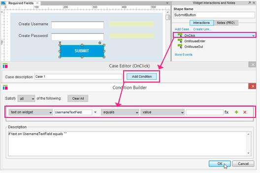
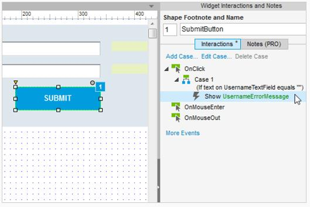
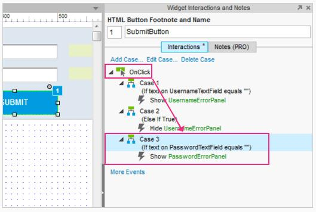
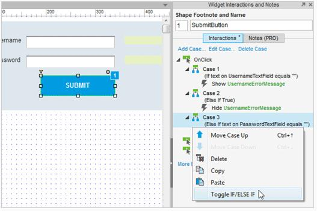
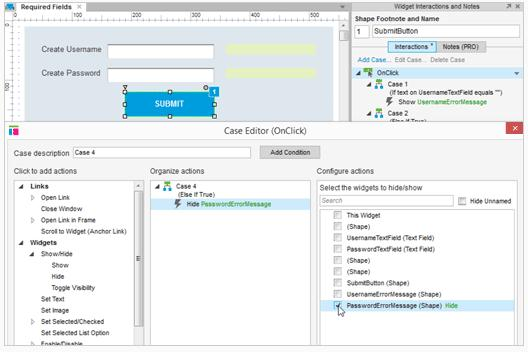
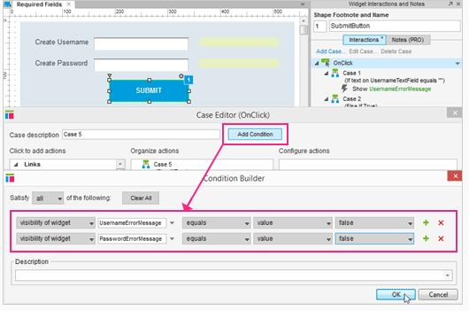
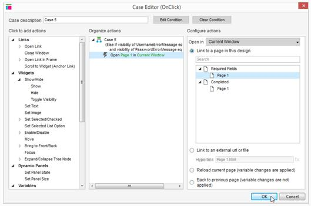
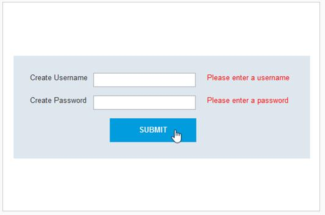

# 条件逻辑：必填字段教程

## 切换 IF / ELSE IF 

### 添加条件到 OnClick 用例 

首先，打开[AxureRequiredFields.rp](downloads/AxureRequiredFields.rp) 并打开“必填字段”页面。

选择提交按钮，并添加一个用例到 OnClick 事件。在用例编辑器中，单击添加条件按钮。  

在条件生成器中，设置条件为“文本小部件：用户名文本字段为空白“，留着文本字段为空白。单击 OK，并关闭条件生成器。

### 添加一个动作来显示

在用例编辑器中，单击“显示”，选择用户名信息错误复选框。单击 OK，并关闭用例编辑器。  

生成原型和测试它吧。如果你用户名文本字段为空白并单击提交按钮，将显示错误消息。

### 添加第二个用例为隐藏 OK

通过双击 OnClick，添加第二个用例到提交按钮。点击“隐藏”并勾选用户名信息错误复选框。单击 OK，并关闭用例编器。  

使用工具栏中的“预览”和在浏览器中刷新原型来测试新的用例。如果你把用户名文本字段留空，然后点击提交，错误面板将会显示。如果你输入文本到用户名文本框并单击提交按钮，错误消息将会被隐藏。

### 添加第三个用例来检查密码字段

通过双击 OnClick 添加第三个用例。这一次，添加条件为“如果文本小部件密码文本字段为空白”，把文本字段值留空。单击 OK，并关闭条件生成器。  

在编辑器中选择“显示”，然后单击“密码信息错误”复选框。然后，单击 OK，并关闭用例编辑器。

### 为用例3切换IF / ELSE IF

右击用例3并选择切换 IF / ELSE IF 。这将“如果其他”改为“如果”。现在用例3会发生，即使用例1或2执行。重新生成原型和测试它吧。把两个文本字段留空将会有两个面板显示错误信息。

### 添加第四用例为隐藏

现在我们可以添加第四个用例为隐藏错误消息，如果一个值已经输入到密码文本字段。双击 OnClick 创建用例4 。选择“隐藏”并选择密码错误面板。  

单击 OK，并关闭用例编辑器。

### 添加最后的用例，其条件为“成功”

最后一用例将包含条件和动作为成功登录。通过双击 OnClick 添加用例5 。单击添加条并和设置第一行条件条件读为“能见度小部件用户名信息值为错误”。然后，单击+图标以添加第二个行条件。设置这行都为“能见度小部件密码的值为错误”。    

单击 OK，并关闭条件生成器。

### 添加动作来链接到第1页

在用例编辑器的当前窗口单击打开链接，并选择第1页。  

单击 OK，并关闭用例编辑器。

### 切换 IF / ELSE IF

我们想把成功用例设为一个 IF 语句，所以它总是不管上面用例的执行情况便进行评估的。右击用例5并选择切换 IF / ELSE IF。

### 预览原型

就是这样了，预览原型和测试它吧。

##总结

这个教程有一点小难度。如果你能很容易的看懂它，你可以说你是一个有很强逻辑性的人。  
还需要其他帮助吗？查看[论坛](http://www.axure.com/c/forum.php)或联系我们 **support@axure.com**
