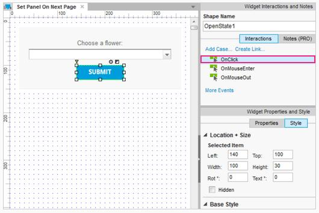
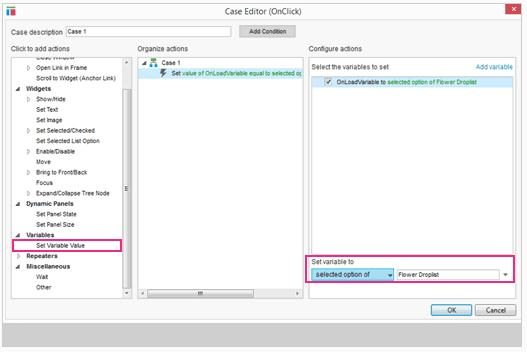
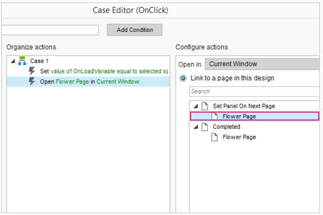
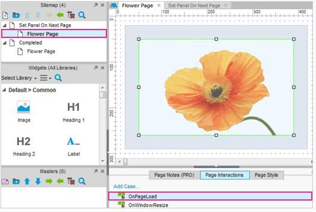
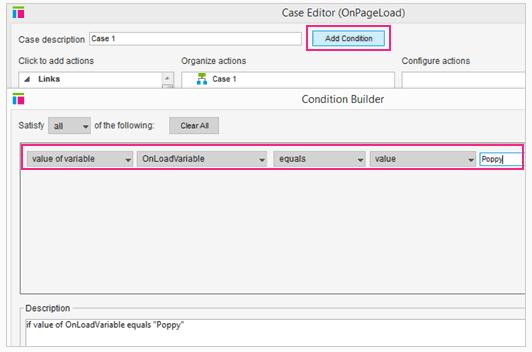
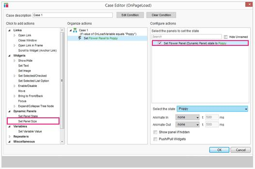
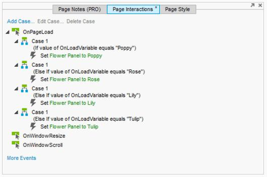

# 在下一个页面上设置面板教程

## 在链接页面改变动态面板的状态 

### 添加用例到单击提交按钮事件

首先，打开[AxureSetPanelOnNextPage.rp](downloads/AxureSetPanelOnNextPage.rp)，打开“在下一页设置面板”页面。在设计区域选择打开状态1按钮并添加一个用例到 OnClick 事件。这将打开用例编辑器对话框。

### 存储下拉列表选择到一个变量中

在本例中，我们想存储变量和打开花朵页面。所以，我们选择“设置变量值”动作，并为 OnPageLoad 变量勾选复选框。在下拉列表中选择“选择选项”，“Flower 下拉列表”将被自动选中。

### 添加动作打开第一页

添加一个动作“开放链接”并指定页面为“花”。注意这里是很重要的，因为此操作需要到这里设置变量值——如果我们先打开页面，变量值永远不会被设置。  
单击 OK，并关闭用例编辑器对话框。

### 添加 OnPageLoad 用例到页面 1

接下来，在站点地图面板打开花页面。在这里，我们要查看什么变量值在前一页被设置，并设置相应的动态面板的状态。在底部的页面交互选项卡窗格中，添加一个用例到 OnPageLoad 事件。

### 添加条件来检查变量值

添加一个条件在用例编辑器中。这将打开条件生成器对话框。将其设置为检查变量 OnLoadVariable 的值为 Value，然后输入“罂粟”到文本值。变量值是很重要的，所以一定要确保这下拉列表中的匹配项是前面的页面。  

单击 OK，并关闭条件生成器对话框。

### 设置花面板的状态

如果加载的变量值是“罂粟”，我们将在页面上的动态面板展示罂粟的图片。所以，我们添加行动“设置面板状态”，选择花的面板，并从下拉列表中选择“罂粟”状态。  
单击 OK，并关闭用例编辑器对话框。

### 添加 OnPageLoad 到每个选项

在 OnPageLoad 事件，添加超过3个的用例。在每种情况下，增加一个条件来检查变量加载的值为数字(1、2和3)并设置花的面板动态面板到适当的状态。最后在页面加载的情况下应该是上面的一个截图。

### 预览原型

预览您的原型和测试它。选择一个按钮将你带到后面的页面并显示相关状态。

##总结

现在你知道如何使用变量连接窗口值从一个页面到另一个页面了吗？  
还需要其他帮助吗？查看[论坛](http://www.axure.com/c/forum.php)或联系我们 **support@axure.com**

