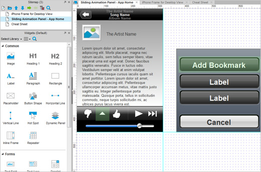
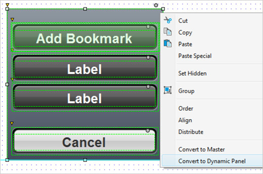
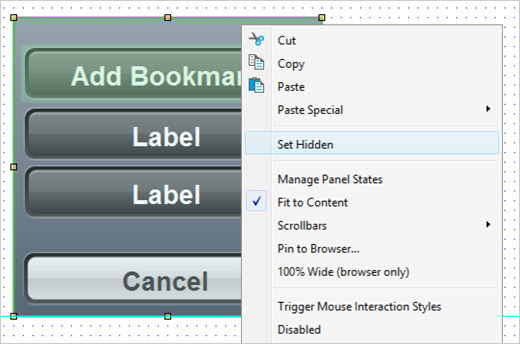
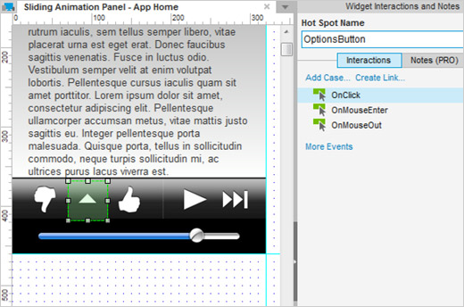
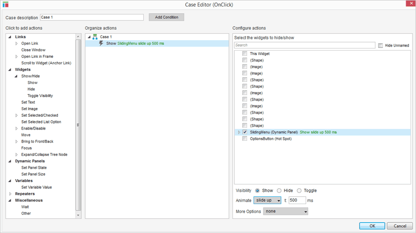
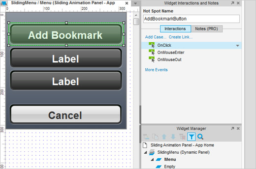
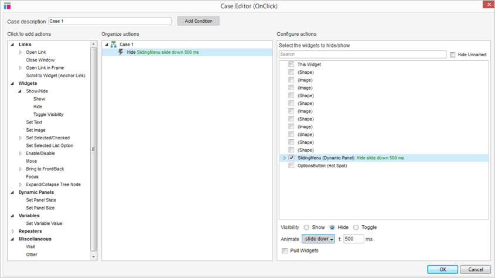
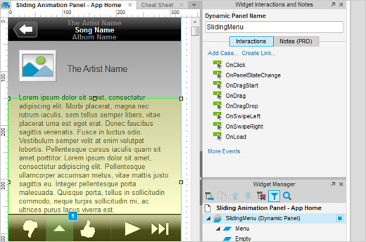

# 关于 iPhone 应用程序的教程和培训的文章  
# 滑动菜单教程  
##滑动菜单教程概述
本教程演示如何创建一个常用来隐藏和显示菜单的滑动动画。当设计 iPhone 应用程序原型，你可以使用这种技术来隐藏和显示上传菜单，设置选项，或者通过上下滑动隐藏任意的展示。
## 面板的滑上
###1. 新增热点  

首先，打开[axureiphoneapp.zip](downloads/AxureiPhoneAppResources.zip) 和  iphoneaslidingmenututorial.rp 文件。由于底部导航是一个单一的图像，我们可以在图标大拇指向>上和向下之间新增一个热点选项按钮。同时，在 Add >Bookmark 按钮上也添加热点，因为它是用两个控件创建的，我们希望整个地区被点击添加热点。   
###2. 转换菜单到动态面板  

为了创建滑动动画我们将会使用 Set Panel State 。首先，通过窗口小部件将整个活动菜单转换到一个动态的面板上，点击右键，并选择[转换到动态面板]，标记面板为 “SlideUpMenu”。
###3. 设置面板为隐藏  

现在设置遇到错误时动态面板自动隐藏。假如你不能点击或者打开可见的动态面板即使状态是空的，我们就需要面板隐藏起来。
###4. 在热点上添加 OnClick 

现在让我们通过 OnClick 的 OptionsButton 新增一个互动，热点我们在第一步时已经添加过了。双击 OnClick 进行事件的添加。
###5. 面板显示与滑动  

添加“显示”动作并选择 SlidingMenu 复选框。在弹出的下拉框里选择“滑上”，然后点击 OK 确定并关闭引导。标记好该项面板并设置为自动显示，以便我们不需要再添加一个显示面板的作用。
## 面板的滑下
###1.打开菜单，添加事件到 Onclick  

在插件管理器通过双击状态1打开菜单状态并在我们之前设置过热点的“添加书签”那里添加一个 Onclick 事件。
###2. 隐藏面板，滑下  

要隐藏面板我们将使用“隐藏”动作并点击“滑落”动画。
###3. 将 SlideUpMenu 归位 
 

最后将 slideupmenu 到位，你可以按住 Shift 的同时拖动它沿一个轴移动。生成你的原型和测试了。上传到axshare和你的设备上查看。如果隐藏菜单没有正常工作，确保行动是正确的顺序。
##总结
现在你已经学会创建菜单和滑动的技术。明智地使用它吧！  
还需要其他帮助吗？查看[论坛](http://www.axure.com/c/forum.php)或联系我们 **support@axure.com**

