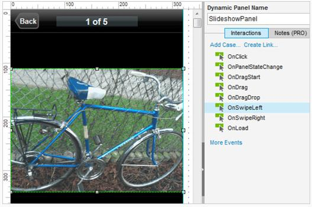
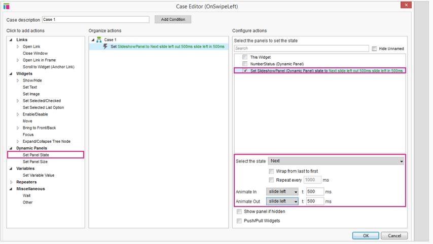
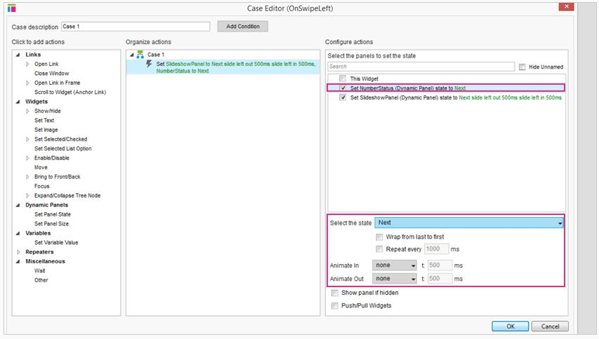
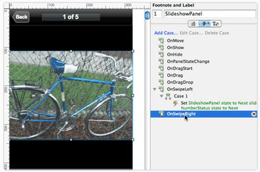
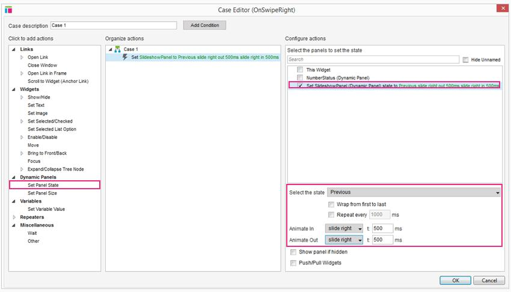
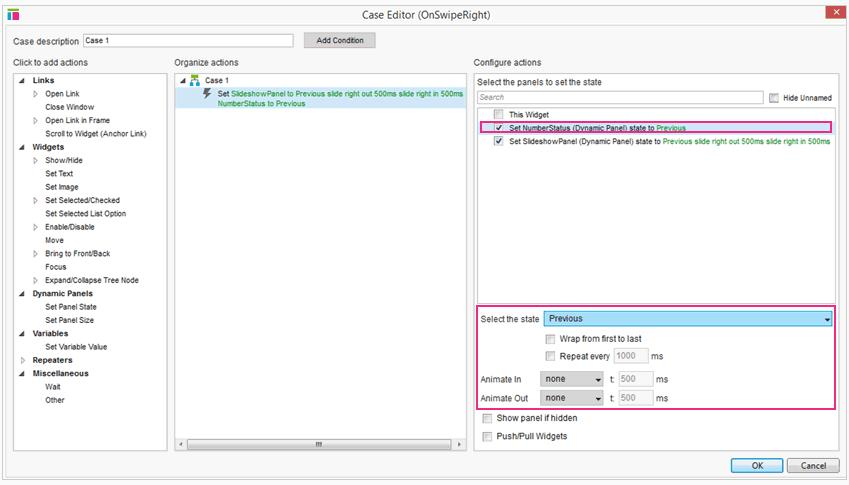

# iPhone 应用程序教程&培训的文章
# Swipping 幻灯片教程

## Swipping 幻灯片教程概述

这个 iPhone 应用程序教程教你如何制作一个跳转变化时的图像幻灯片。这个示例使用的是图片，但是你可以用同样的方法在任何情况下向左或向右划动屏幕上的内容像变化屏幕过渡教程一样。

这个例子也改变了许多目前显示(即2/5)的指示图像。同样的技术可以应用于创建状态指标，例如一系列有不同的颜色圆圈里面的一个正方形或者圆形。

##移动旋转木马 
 
### 添加 OnSwipeLeft SlideshowPanel

 
首先，打开[AxureiPhoneApp.zip](download/AxureiPhoneAppResource.zip)并打开 iPhoneApp-SwipingSlideshowTutorial.rp 文件。
选择 SlideshowPanel OnSwipeLeft 事件并双击打开编辑器。
 
### SlideshowPanel 设置为下一个状态

 
选择设置面板 SlideshowPanel 行动并单击复选框状态。在 droplist 选择“下一个”面板状态并选择“幻灯片左”动画的动画和动画。

不要关闭案例编辑器。

### 设置面板 NumberStatus 下一个状态

现在，单击复选框 NumberStatus 面板。在 droplist 选择“下一个”面板状态但离开动画默认的“没有”。

单击OK关闭编辑器。
 
### 添加 OnSwipeRight SlideshowPanel

 
现在让我们为 OnSwipeRight 添加交互。选择 SlideshowPanel 并双击 OnSwipeRight 打开编辑器。

### 设置 SlideshowPanel 之前的状态

选择设置面板 SlideshowPanel 行动并单击复选框状态。在 droplist 选择“前”面板状态并选择“幻灯片”动画的动画/。 

### 设置 NumberStatus 之前的状态

现在，单击复选框 NumberStatus 面板。在 droplist 选择“前”面板状态但离开动画默认的“没有”。
单击OK关闭编辑器，然后生成桌面或案例把它放在你的 iPhone 上.

## 总结
 
现在您可以创建一个刷图像旋转木马或使用刷卡事件进行导航。  
还需要其他帮助吗？查看[论坛](http://www.axure.com/c/forum.php)或联系我们 **support@axure.com**
