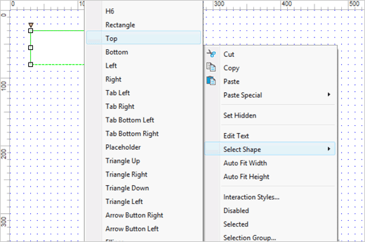
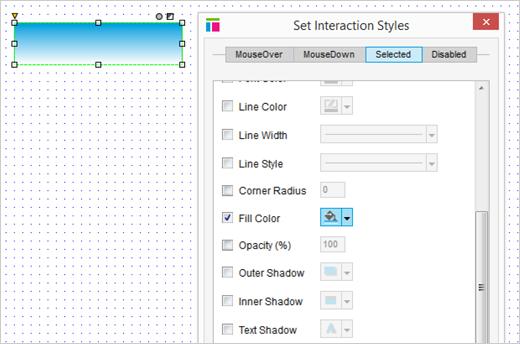
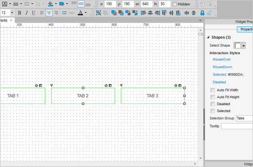
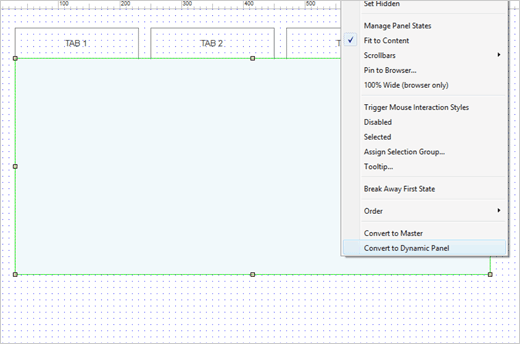
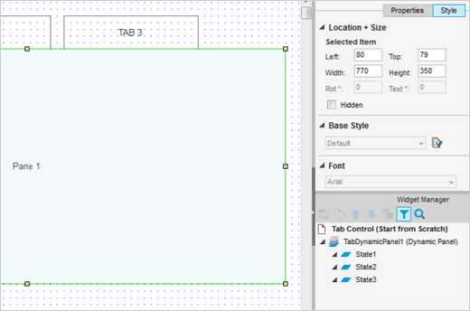
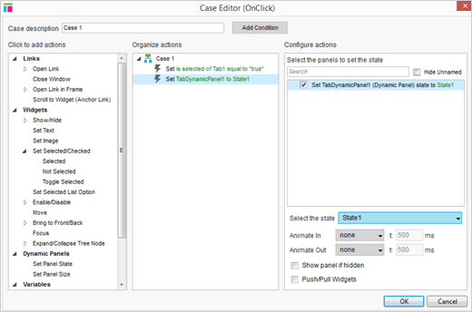
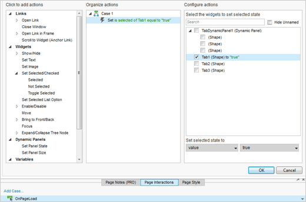

# 选项板部件

## 将一个矩形设置进选项板中去

可下载的 RP 文件已被作为例子包含到最终的产品中去。在此次向导中我们将会从头构造这个例子。

添加一个矩形部件到设计区域，右键单击矩形的底边，选择弹出菜单中的选项 Select Shape > Top，改变矩形的形状。

在工具栏中点击 Fill Color 按钮来设置默认颜色，确保透明度为 100 %。

## 编辑选项板的选择样式

为了区分选项板默认状态和被选中时的样式，点击 Properties 选项板中的 Selected，选中复选按钮 Fill Color 然后点击设置填充的颜色。

在这例子中，我们使用的填充类型为 Linear Gradient，从右边的滑动条中选中蓝色。

## 复制、粘贴，添加到选项组中去

现在，复制和粘贴矩形两次，然后你就有三个完全相同的选项板，排列好他们。

为了在同一时刻只显示一个选项板，全选它们，然后打开 Properties 面板，选中一个名为 Selection Group 的选项，命名这个选项组。

在属性面板中分别标记你的选项板为 Tab1，Tab2，Tab3。输入标记到 Tab1，Tab2，Tab3。

## 添加一个矩形，转换为动态面板

拖动另一个矩形部件到设计区域，将其安置在选项板下面。然后，右键单击新的矩形，单击 Convert to Dynamic Panel 选项。

为确保选项板的底边与动态面板的顶边重合，右键单击动态面板选中 Order > Send to Back 选项，然后使用键盘方向键移动一像素点。 

## 重复状态，编辑文本

在部件管理器中，标记面板为 TabDynamicPanel1。重复这个状态两次，总计三次。一般地，状态一般命名为 State1，State2，和 State3。

向矩形 Pane 1， Pane 2 和 Pane 3 输入文字。

## 添加 OnClick 事件

选中 Tab1 然后编辑他的 OnClick 事件。首先添加 Set Selected 动作，放置一个标记 Tab1 的复选框。 在默认的 True 选项中移除 value 下拉菜单。

接着，添加另一个动作 Set Panel State。在 TabDynamicPanel1 复选框中选中它，在 Select the state 的下拉菜单中将其设置为 State1。
  
对第二个和第三个选项板重复上诉步骤。确保 Tab2 和 State2 是第二个选项板， Tab3 和 State3 是第三个选项板的。

## 设置活动选项板

设置页面加载时默认显示的选项板。

在 Page Interactions 选项板中为页面添加一个事例到页面的 OnPageLoad 事件中去。在 Tab1 的复选框中选择 Set Selected 动作。移除默认的选项在单击 OK。

## 预览原型

预览你的原型然后去测试吧。
