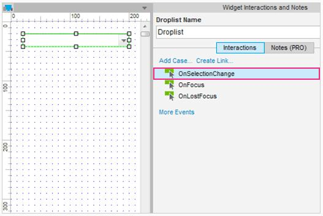
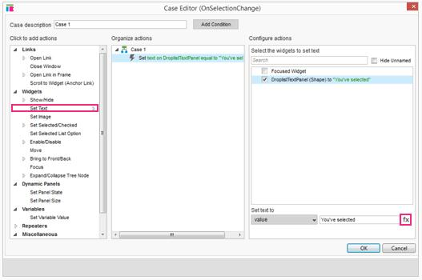
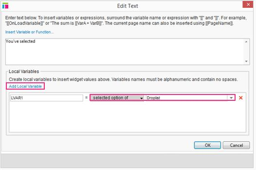
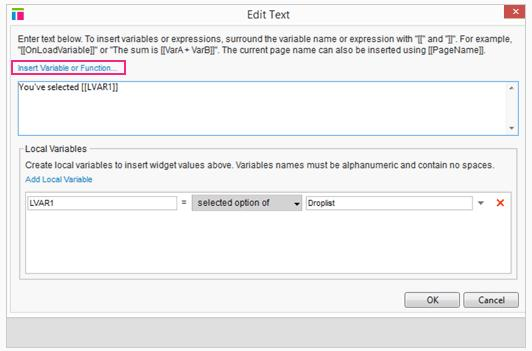
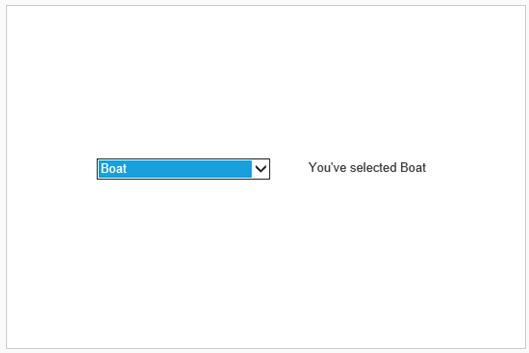

# 设置文本下拉列表选择教程

## 下拉列表选择插入文本

### 添加用例到 OnChange 事件

首先，打开[SettingTextOnDroplistSelection.rp](downloads/SettingTextOnDroplistSelection.rp)，打开“在下拉列表选择设置文本”页面。

在设计区域选择下拉列表小部件并添加选择改变时事件。这将打开编辑器对话框。

### 在下拉列表面板上设置文本

在用例编辑器中，选择“设置文本”动作。选择下拉列表面板复选框，然后单击“fx”按钮。这将打开文本编辑对话框。

### 为下拉列表选择创建局部变量

我们想暂时存储选择了的下拉选项在一个局部变量。要做到这一点，要在文本编辑对话框的底部。点击“添加本地变量”，设置 LVAR1 为“选择选项“值为下拉列表小部件。这将用户选择的下拉列表项存储在本地变量 LVAR1 中。

### 插入本地变量值到文本

现在我们已经创建了局部变量，我们可以将其插入到文本。文本”你选择“已经在编辑器中，所以我们将光标放在文本的后面，并从右边的插入变量或函数的下拉菜单中选择 “LVAR1”。现在的文本为，”你选择[[LVAR1]]”。在原型上，在文本中下拉列表选项将自动取代“[[LVAR1]]”。  
单击 OK，并关闭打开的对话框。

### 预览原型

   

预览您的原型和测试它吧。选择下拉列表项将更新右边的文本，以反映您的选择。

##总结

现在你可以切换高频的文本使用下拉列表，选择改变时事件，局部变量和设置文本的行动。继续你的炫耀吧！  
还有什么要帮助的吗？查看[论坛](http://www.axure.com/c/forum.php)或写信给我们**support@axure.com**.
