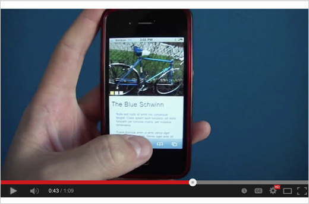
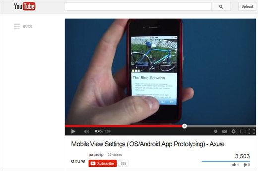
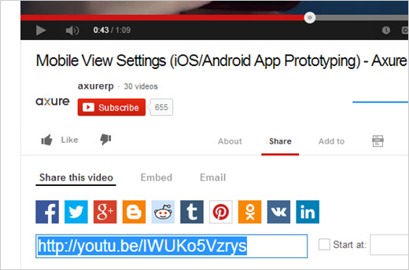
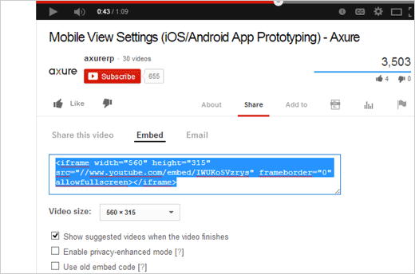
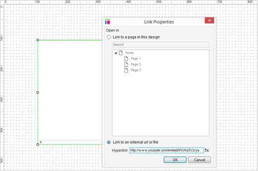

# WEB 设计教学与训练文档 之 嵌入式视频和地图教程

## 关于内联框架（浮动框架、页内框架，内嵌框架）
内联框架（inline frames）可以用来为你的原型添加任意外部 HTML 内容，但他们用于嵌入外站视频（例如 YouTube、Vimeo 等）或者在线地图（例如谷歌地图）时显得特别有用。其中最难的地方也不过是如何从这些外站获取目标 URL 而已。一个嵌入式视频和地图的示例工程可以在 [AxureWebsite.zip](downloads/AxureWebsite.zip) 内找到，双击内联框架就能看见其目标 URL。

## 常用的内联框架嵌入式媒体

### 嵌入式视频

大多数像 Vimeo、YouTube 这类的视频托管服务都会允许你通过他们提供的嵌入码（embed code）来将视频放在您的网页上。您可以将那些嵌入码内的 URL 放进内联框架小部件中，将其嵌入原型内。

### 嵌入式地图

你可以通过内联框架小部件将谷歌地图直接被嵌入到您的网页原型中。在谷歌地图界面中，点击页面底部的齿轮图标，选择“分享并嵌入地图”选项，切换到“嵌入地图”选项，然后将嵌入码复制下来，提取里面的 URL 并将其载入到内联框架小部件中。

## 详细逐步示例

### 去目标视频或者地图的地址

首先，打开 [AxureWebsite.zip](downloads/AxureWebsite.zip) 里面的 Website-InlineFrame.rp，然后打开 Build Your Own 页面。

访问你想要嵌入到原型中的目标视频或者地图站点。

### 点击“分享”或者“超链接”

为了得到 iframe 嵌入码，你需要先找到并点击相应的分享/嵌入码/超链接按钮。例如在谷歌地图中，那个按钮是一个超链接图标。

### 复制 iframe 嵌入码

您也许还需要点击多一些按钮（例如在上图中的 “Embed”）来获得代码。你所需要的代码应以 `<iframe` 开头，找到整段代码并复制下来。

### 删除所有代码，只留下 URL

回到 Axure 并且双击在设计区域中的内联框架小部件。点击 Link to an external URL or file（链接到外部 URL 或文件）的单选框，然后粘贴之前复制下来的代码。

然后，删除所有的代码，除了 URL，URL 通常就在 `src=` 语句的右边。请确保您的 URL 带着 `http://` 前缀，看上图了解正确情况下的样子。

## 总结
在你的内联框架里使用正确的 URL 是至关重要的！寻找 iframe 标记，截取 `src=` 右边的 URL，然后走起！